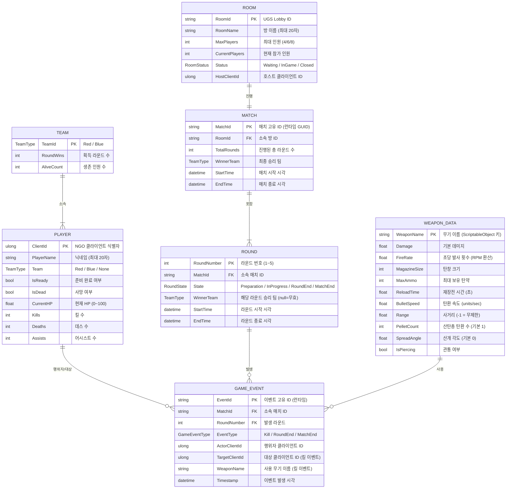

# ERD — 엔티티 관계 다이어그램

프로젝트: Unity 기반 4v4 2D FPS 게임
작성일: 2026-04-05
작성자: architect 에이전트
버전: v1.0

---

## 1. 문서 개요

본 문서는 게임 내 핵심 데이터 모델을 정의한다.
Unity 게임 특성상 영구 저장소(DB)는 MVP 단계에서 사용하지 않으며,
데이터는 런타임 메모리(C# 클래스/ScriptableObject)와 UGS Lobby 메타데이터로 관리한다.
Post-MVP 단계에서 랭크·통계 저장이 필요할 경우 외부 DB 도입을 검토한다.

---

## 2. 데이터 모델 범위

| 저장소 | 용도 | MVP 포함 |
|--------|------|---------|
| 런타임 메모리 (C# 클래스) | 플레이어, 팀, 라운드, 게임 이벤트 상태 | 예 |
| ScriptableObject (에셋) | 무기 스탯, 맵 설정 | 예 |
| UGS Lobby 메타데이터 | 방 정보 (이름, 인원, 상태) | 예 |
| 외부 RDBMS | 랭크, 장기 통계, 플레이어 계정 | Post-MVP |

---

## 3. ERD (런타임 데이터 모델)



---

## 4. 엔티티 상세 명세

### 4.1 PLAYER

| 필드 | 타입 | 설명 |
|------|------|------|
| ClientId | ulong | NGO가 부여하는 클라이언트 고유 ID (NetworkObject의 OwnerClientId) |
| PlayerName | string | 플레이어 닉네임. 입력 최대 20자 |
| Team | TeamType | None / Red / Blue. 입장 시 서버가 랜덤 자동 배정 |
| IsReady | bool | 방 대기실 준비 완료 여부 |
| IsDead | bool | 현재 라운드 사망 여부. 라운드 초기화 시 false 리셋 |
| CurrentHP | float | 0~100. NetworkVariable로 서버 권위 동기화 |
| Kills | int | 현재 매치 킬 수 |
| Deaths | int | 현재 매치 데스 수 |
| Assists | int | 현재 매치 어시스트 수 |

### 4.2 TEAM

| 필드 | 타입 | 설명 |
|------|------|------|
| TeamId | TeamType | Red 또는 Blue |
| RoundWins | int | 현재 매치에서 획득한 라운드 수 (3 먼저 달성 시 승리) |
| AliveCount | int | 현재 라운드 생존 인원 수 (0이 되면 전멸 = 라운드 종료) |

### 4.3 ROOM

| 필드 | 타입 | 설명 |
|------|------|------|
| RoomId | string | UGS Lobby API에서 발급하는 고유 ID |
| RoomName | string | 방장이 입력한 방 이름 (최대 20자, 중복 허용) |
| MaxPlayers | int | 4 / 6 / 8 선택 |
| CurrentPlayers | int | 현재 참가 인원. 5초 주기로 UGS에서 갱신 |
| Status | RoomStatus | Waiting(대기중) / InGame(게임중) / Closed(종료) |
| HostClientId | ulong | 현재 호스트(방장) 클라이언트 ID |

### 4.4 MATCH

| 필드 | 타입 | 설명 |
|------|------|------|
| MatchId | string | 런타임 GUID (매치 시작 시 생성) |
| RoomId | string | 소속 방 ID |
| TotalRounds | int | 실제 진행된 라운드 총수 |
| WinnerTeam | TeamType | 최종 승리 팀 |
| StartTime | datetime | 매치 시작 시각 |
| EndTime | datetime | 매치 종료 시각 |

### 4.5 ROUND

| 필드 | 타입 | 설명 |
|------|------|------|
| RoundNumber | int | 1~5 |
| MatchId | string | 소속 매치 ID |
| State | RoundState | WaitingForPlayers / Preparation / InProgress / RoundEnd / MatchEnd |
| WinnerTeam | TeamType | 라운드 승리 팀 (null = 무효 라운드) |
| StartTime / EndTime | datetime | 라운드 시간 범위 |

### 4.6 GAME_EVENT

| 필드 | 타입 | 설명 |
|------|------|------|
| EventId | string | 런타임 GUID |
| EventType | GameEventType | Kill / RoundEnd / MatchEnd |
| ActorClientId | ulong | 킬러 또는 이벤트 트리거 주체 |
| TargetClientId | ulong | 사망자 (Kill 이벤트 한정) |
| WeaponName | string | 사용 무기 이름 (Kill 이벤트 한정, 킬 피드 표시용) |
| Timestamp | datetime | 이벤트 발생 시각 |

### 4.7 WEAPON_DATA (ScriptableObject)

| 필드 | 타입 | 소총 | 산탄총(M4) | 저격총(M4) |
|------|------|------|-----------|-----------|
| Damage | float | 25 | 15 | 100 |
| FireRate | float | 10/sec | 1.33/sec | 0.67/sec |
| MagazineSize | int | 30 | 6 | 5 |
| MaxAmmo | int | 90 | 24 | 15 |
| ReloadTime | float | 2.0 | 2.5 | 3.0 |
| BulletSpeed | float | 30 | 20 | 50 |
| Range | float | -1 | 10 | -1 |
| PelletCount | int | 1 | 6 | 1 |
| SpreadAngle | float | 0 | 15 | 0 |
| IsPiercing | bool | false | false | true |

---

## 5. 열거형 정의

```csharp
public enum TeamType
{
    None,   // 미배정
    Red,    // Red Team
    Blue    // Blue Team
}

public enum RoundState
{
    WaitingForPlayers,  // 플레이어 대기 중
    Preparation,        // 라운드 준비 (5초 카운트다운)
    InProgress,         // 라운드 진행 중
    RoundEnd,           // 라운드 종료 (결과 팝업 3초)
    MatchEnd            // 매치 종료
}

public enum RoomStatus
{
    Waiting,    // 참가 가능
    InGame,     // 게임 진행 중 (입장 불가)
    Closed      // 종료됨
}

public enum GameEventType
{
    Kill,
    RoundEnd,
    MatchEnd
}
```

---

## 6. 데이터 흐름 요약

```
[방 입장]
  UGS Lobby API → ROOM 생성/조회
  RoomManager → PLAYER 생성, TeamType 랜덤 배정

[라운드 진행]
  RoundManager → ROUND 상태 관리 (NetworkVariable)
  HealthSystem → PLAYER.CurrentHP 갱신 (NetworkVariable)
  WeaponController → 발사 이벤트 → BulletController → HealthSystem
  HealthSystem → GAME_EVENT(Kill) 생성 → 킬 피드 표시 + KDA 갱신

[매치 종료]
  RoundManager → MATCH.WinnerTeam 확정
  ResultUIController → PLAYER KDA 스코어보드 표시
```
