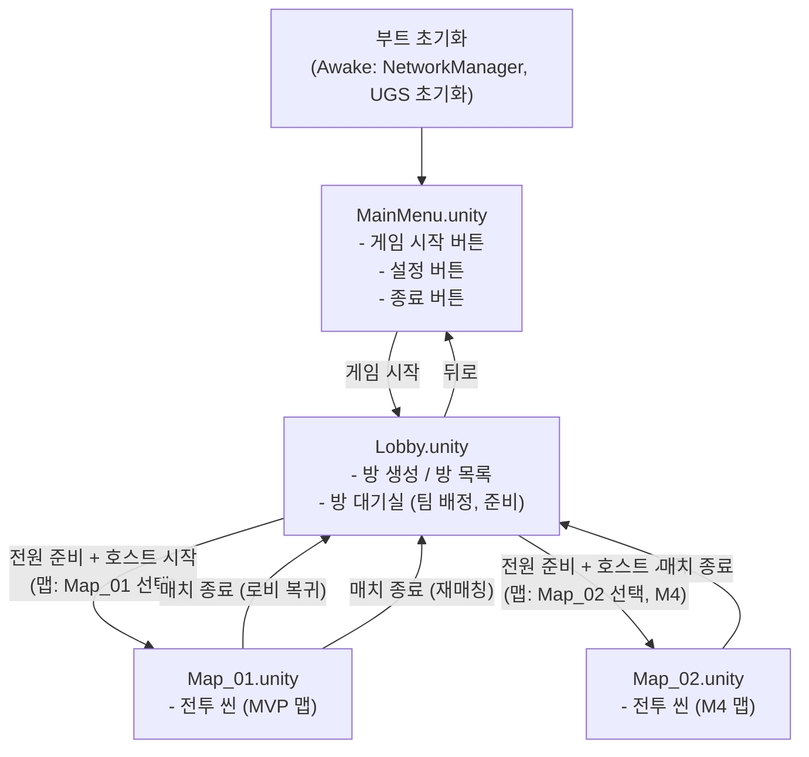

# 씬 구조 설계서

프로젝트: Unity 기반 4v4 2D FPS 게임
작성일: 2026-04-05
작성자: architect 에이전트
버전: v1.0

---

## 1. 씬 목록

| 씬 이름 | 파일 경로 | 포함 마일스톤 | 설명 |
|---------|----------|--------------|------|
| MainMenu | `Assets/Scenes/MainMenu.unity` | M1 | 메인 메뉴 (게임 시작, 설정, 종료) |
| Lobby | `Assets/Scenes/Lobby.unity` | M2 | 로비 + 방 대기실 (방 생성/참가/팀 구성) |
| Map_01 | `Assets/Scenes/Map_01.unity` | M2 | 실내형 기본 맵 (MVP 전투 씬) |
| Map_02 | `Assets/Scenes/Map_02.unity` | M4 | 실외형/오픈형 맵 (M4 추가) |
| Prototype | `Assets/Scenes/Prototype.unity` | M1 | 개발 테스트용 씬 (빌드 제외) |

---

## 2. 씬 전환 흐름



---

## 3. 씬별 상세 설계

### 3.1 MainMenu.unity

#### 구성 GameObjects

```
MainMenu [Scene Root]
  ├── Camera
  │     └── Main Camera (Orthographic)
  ├── UI_Canvas
  │     ├── TitleText ("4v4 2D FPS")
  │     ├── StartButton → Lobby.unity 전환
  │     ├── SettingsButton → 설정 패널 활성화 (M4)
  │     └── QuitButton → Application.Quit()
  ├── SettingsPanel [비활성, M4 구현]
  │     ├── VolumeSlider
  │     └── ResolutionDropdown
  └── AudioSource (BGM)
```

#### 초기화 처리

- Awake: UGS Authentication.SignInAnonymouslyAsync() 호출
- UGS 초기화 완료 후 StartButton 활성화
- UGS 초기화 실패 시 "서버 연결 실패" 메시지 표시 + LAN 모드 폴백 옵션

---

### 3.2 Lobby.unity

#### 구성 GameObjects

```
Lobby [Scene Root]
  ├── Camera
  │     └── Main Camera (Orthographic)
  ├── NetworkManager [DontDestroyOnLoad]
  │     ├── Unity Transport (UTP)
  │     └── NetworkPrefabs 설정
  ├── LobbyManager (UGS Lobby 연동)
  ├── RoomManager (팀 배정, 방 상태)
  ├── UI_Canvas
  │     ├── LobbyMainPanel
  │     │     ├── QuickMatchButton → 빠른 매칭
  │     │     ├── BrowseRoomsButton → 방 목록 패널
  │     │     └── CreateRoomButton → 방 생성 모달
  │     ├── RoomListPanel [조건부 표시]
  │     │     ├── RoomListScrollView
  │     │     │     └── RoomListItem (방 이름, 인원, 상태, 입장 버튼)
  │     │     └── RefreshButton (5초 자동 갱신 + 수동 갱신)
  │     ├── CreateRoomModal [조건부 표시]
  │     │     ├── RoomNameInput (최대 20자)
  │     │     ├── MaxPlayersDropdown (4/6/8)
  │     │     └── ConfirmButton
  │     └── WaitingRoomPanel [방 입장 후 표시]
  │           ├── RedTeamSlots (x4)
  │           ├── BlueTeamSlots (x4)
  │           ├── TeamChangeButton (빈 슬롯 있을 때 활성)
  │           ├── ReadyButton (토글)
  │           ├── StartButton [호스트 전용, 전원 Ready 시 활성]
  │           └── ChatPanel (텍스트 채팅)
  └── AudioSource (로비 BGM)
```

#### 로비 씬 상태 흐름

```
Lobby 씬 진입
  → LobbyMainPanel 표시
  → 빠른 매칭 선택: QuickJoinLobby API 호출
  → 방 탐색 선택: RoomListPanel 표시, 5초 갱신 시작
  → 방 생성: CreateRoomModal → CreateLobby API 호출
  → 방 입장 성공: WaitingRoomPanel 표시
  → 팀 배정 수신 (서버 랜덤 배정)
  → 준비 완료 토글
  → 호스트: 전원 Ready → StartButton 활성화 → 씬 전환 (LoadScene RPC)
```

---

### 3.3 Map_01.unity (전투 씬 — MVP)

#### 맵 특성

- 스타일: 실내형, 박스 레이아웃 (복도 + 중앙 홀 구조)
- 크기: 20x20 units 이상
- 장애물: 최소 10개 (벽, 상자, 기둥 엄폐물)

#### 구성 GameObjects

```
Map_01 [Scene Root]
  ├── Camera
  │     └── Main Camera (Orthographic, 플레이어 추적)
  ├── GameManager
  │     ├── RoundManager (라운드 FSM)
  │     └── TeamManager (팀 구성, 전멸 감지)
  ├── NetworkManager [DontDestroyOnLoad에서 이동 또는 동일 인스턴스 재사용]
  ├── Map
  │     ├── Background (바닥 타일)
  │     ├── Walls (외벽 콜라이더)
  │     ├── Obstacles (엄폐물 x10+)
  │     ├── SpawnPoints_Red (x4, 맵 좌측)
  │     └── SpawnPoints_Blue (x4, 맵 우측)
  ├── PlayerContainer [런타임 생성]
  │     ├── Player_Red_1..4 (Prefab 인스턴스)
  │     └── Player_Blue_1..4 (Prefab 인스턴스)
  ├── UI_Canvas [Screen Space - Overlay]
  │     ├── HUD
  │     │     ├── HPBar (색상 상태 표시)
  │     │     ├── AmmoDisplay (현재/보유)
  │     │     ├── TeamScoreDisplay (Red N : M Blue)
  │     │     ├── RoundTimerDisplay
  │     │     └── KillFeedPanel (최근 3건, 4초 페이드 아웃)
  │     ├── CountdownPanel (라운드 준비 카운트다운)
  │     ├── RoundResultPopup (3초 표시)
  │     ├── DeathScreen (사망 대기 화면)
  │     └── MatchResultPanel (최종 결과, KDA 스코어보드)
  └── AudioManager
        ├── SFX_Fire (발사 사운드)
        ├── SFX_Hit (피격 사운드)
        ├── SFX_Death (사망 사운드)
        └── BGM_Battle
```

#### 플레이어 Prefab 구조

```
Player_[Team].prefab
  ├── SpriteRenderer (팀 색상 구분)
  ├── Rigidbody2D
  ├── Collider2D (Body Hitbox)
  ├── HeadHitbox [자식 Collider2D, 태그: HeadHitbox]
  ├── MuzzlePoint [총구 위치 Transform]
  ├── PlayerMovement.cs
  ├── PlayerController.cs
  ├── WeaponController.cs
  ├── HealthSystem.cs (NetworkBehaviour)
  ├── PlayerNetworkSync.cs (NetworkBehaviour)
  ├── NetworkTransform (NGO 컴포넌트)
  └── NetworkObject (NGO 컴포넌트)
```

---

### 3.4 Map_02.unity (전투 씬 — M4)

#### 맵 특성

- 스타일: 실외형/오픈형 (넓은 공간 + 분산된 엄폐물)
- 크기: 30x30 units 이상 (Map_01보다 넓음)
- 장애물: 최소 15개 (나무, 바위, 건물 외벽 엄폐물)

맵 특성 외 UI/GameManager 구조는 Map_01.unity와 동일하게 Prefab 공유.

---

### 3.5 Prototype.unity (개발 테스트용)

빌드 설정(Build Settings)에서 제외. 개발자 전용.

```
Prototype [Scene Root]
  ├── [Map_01 맵 요소 일부]
  ├── DummyBot_Red (AI 더미봇)
  ├── DummyBot_Blue (AI 더미봇)
  └── TestHarness (UnityEvent 기반 시나리오 트리거)
```

---

## 4. 씬 간 데이터 전달

### DontDestroyOnLoad 오브젝트

| 오브젝트 | 역할 |
|---------|------|
| NetworkManager | NGO 연결 유지 (씬 전환 시 파괴 방지) |
| AudioManager | BGM 전환 (씬 간 연속 재생) |

### 씬 전환 방식

```csharp
// 호스트가 씬 전환 명령 → 모든 클라이언트 동시 전환
NetworkManager.Singleton.SceneManager.LoadScene("Map_01", LoadSceneMode.Single);
```

NetworkSceneManager를 사용하여 모든 클라이언트가 동시에 씬을 전환한다.
클라이언트 개별 LoadScene 호출 불가.

---

## 5. 에셋 폴더 구조

```
Assets/
  Scenes/
    MainMenu.unity
    Lobby.unity
    Map_01.unity
    Map_02.unity          (M4)
    Prototype.unity       (빌드 제외)

  Scripts/
    Player/
      PlayerMovement.cs
      PlayerController.cs
    Combat/
      WeaponController.cs
      BulletController.cs
      HealthSystem.cs
      IDamageable.cs        (인터페이스)
    Team/
      TeamManager.cs
    GameManager/
      RoundManager.cs
      GameManager.cs
    Network/
      NetworkManager.cs
      PlayerNetworkSync.cs
    Lobby/
      LobbyManager.cs
      RoomManager.cs
    UI/
      HUDController.cs
      KillFeedController.cs
      LobbyUIController.cs
      ResultUIController.cs
    Data/
      WeaponData.cs           (ScriptableObject)
      PlayerData.cs
    Utilities/
      ObjectPool.cs
      InputValidator.cs

  Prefabs/
    Player/
      Player_Red.prefab
      Player_Blue.prefab
    Weapons/
      Bullet.prefab
      Bullet_Shotgun.prefab   (M4)
      Bullet_Sniper.prefab    (M4)
    UI/
      HUD.prefab
      KillFeedItem.prefab
      RoomListItem.prefab

  ScriptableObjects/
    Weapons/
      Rifle.asset
      Shotgun.asset           (M4)
      Sniper.asset            (M4)

  Audio/
    SFX/
      Fire_Rifle.wav
      Fire_Shotgun.wav        (M4)
      Fire_Sniper.wav         (M4)
      Hit.wav
      Death.wav
    BGM/
      BGM_Menu.mp3
      BGM_Battle.mp3

  Sprites/
    Player/
      Player_Red.png
      Player_Blue.png
    Map/
      Tileset_Indoor.png
      Tileset_Outdoor.png     (M4)
    Weapons/
      Icon_Rifle.png
      Icon_Shotgun.png        (M4)
      Icon_Sniper.png         (M4)
    UI/
      HUD_HPBar.png
      KillFeed_Arrow.png
```

---

## 6. 씬 로딩 최적화

| 항목 | 방식 |
|------|------|
| 씬 전환 로딩 | `LoadSceneMode.Single` + 로딩 화면(Progress Bar) |
| 메모리 해제 | 씬 언로드 후 `Resources.UnloadUnusedAssets()` 호출 |
| 오브젝트 풀 | Bullet Pool 씬 로드 시 초기화 (기본 50개) |
| 비동기 로딩 | `SceneManager.LoadSceneAsync`로 로딩 화면 중 백그라운드 로드 |
