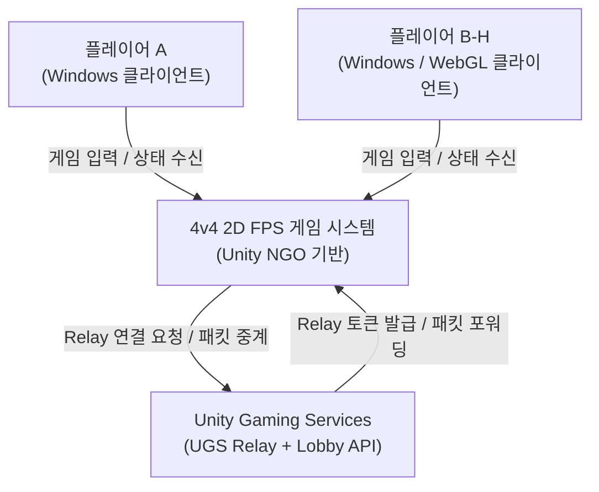
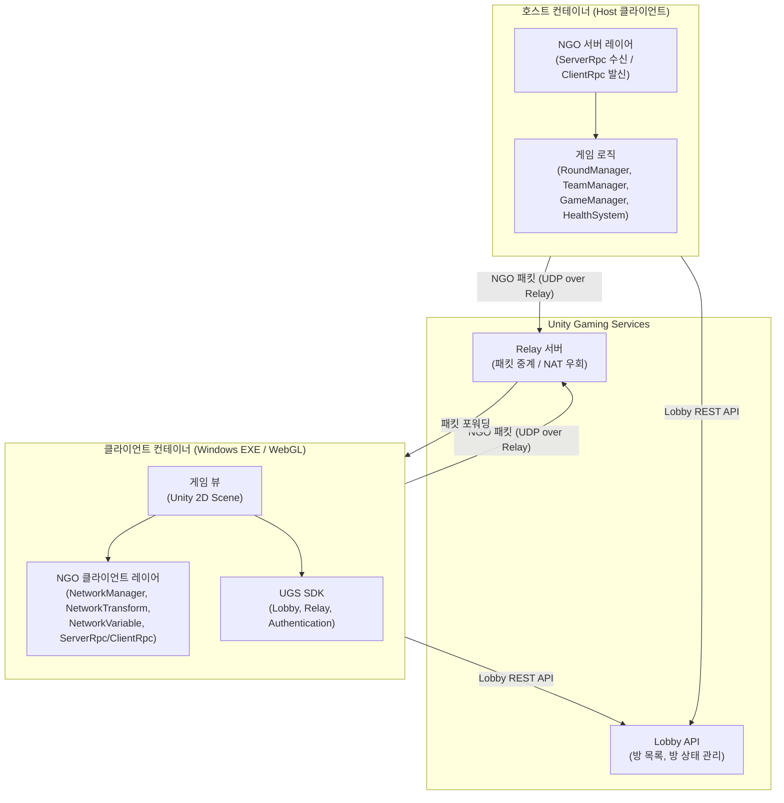
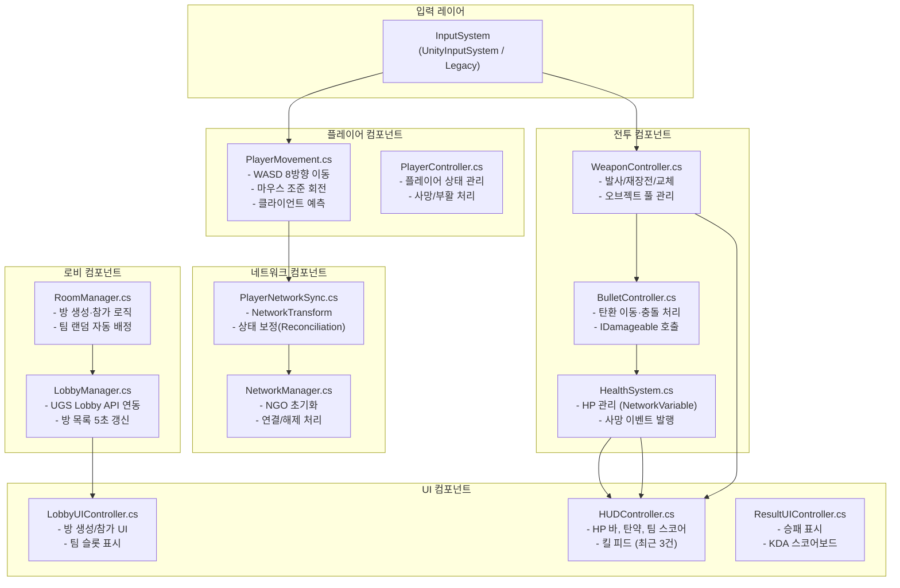
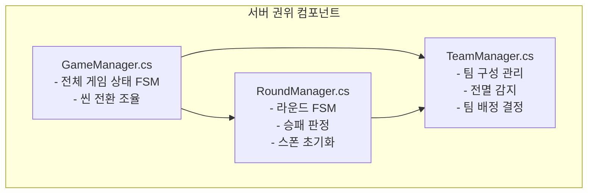
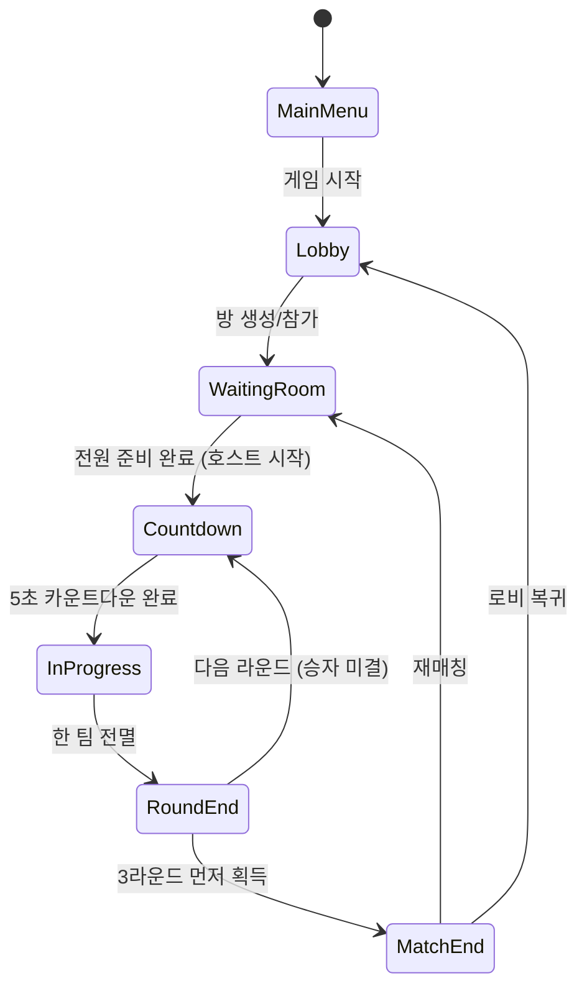

# 시스템 아키텍처 설계서

프로젝트: Unity 기반 4v4 2D FPS 게임
작성일: 2026-04-05
작성자: architect 에이전트
버전: v1.0

---

## 1. 문서 개요

본 문서는 C4 모델(Context, Container, Component) 기준으로 전체 시스템 아키텍처를 기술한다.
Unity 클라이언트 / UGS Relay / NGO Host 구조를 중심으로 설계한다.

---

## 2. C4 Level 1 — 시스템 컨텍스트 다이어그램



### 외부 행위자

| 행위자 | 설명 |
|--------|------|
| 플레이어 (최대 8명) | Windows PC 또는 WebGL 브라우저로 게임 클라이언트에 접속 |
| Unity Gaming Services (UGS) | Relay 서버 — 클라이언트 간 NAT 우회 패킷 중계 및 Lobby API 제공 |

---

## 3. C4 Level 2 — 컨테이너 다이어그램



### 컨테이너 설명

| 컨테이너 | 기술 | 역할 |
|---------|------|------|
| 클라이언트 (Windows) | Unity 2022 LTS, C#, NGO | 게임 렌더링, 입력 처리, 클라이언트 예측 |
| 클라이언트 (WebGL) | Unity 2022 LTS WebGL Build | 브라우저 실행, UGS Relay 필수 의존 |
| 호스트 클라이언트 | Unity 2022 LTS + NGO Host Mode | 서버 권위 로직 실행 (방장 클라이언트) |
| UGS Relay | Unity Gaming Services | UDP 패킷 중계, NAT 우회, 서버 부담 없이 P2P 구조 유지 |
| UGS Lobby API | Unity Gaming Services | 방 생성·조회·참가·방 목록 갱신 (5초 주기) |

### 중요 아키텍처 결정: Host-Client 구조

MVP 단계에서는 전용 게임 서버 없이 **호스트 클라이언트(방장)가 NGO Host 역할**을 겸한다.
- 장점: 서버 인프라 비용 없음, UGS Relay와 자연스럽게 통합
- 단점: 호스트 이탈 시 호스트 이전(Migration) 처리 필요, 호스트 유리 가능성
- 대응: NGO Host Migration 활성화, 서버 권위 로직은 호스트에서만 실행

Post-MVP(M5 이후)에서 전용 서버 또는 자체 Relay 서버로 전환을 검토한다.

---

## 4. C4 Level 3 — 컴포넌트 다이어그램

### 4.1 클라이언트 컴포넌트



### 4.2 호스트(서버 권위) 컴포넌트



---

## 5. 게임 상태 머신 (FSM)



---

## 6. 팀 배정 흐름

```
플레이어 방 입장 요청
  → RoomManager (서버): 현재 Red/Blue 팀 인원 조회
  → 인원이 적은 팀으로 랜덤 배정 (균형 우선)
    → 두 팀 동일 인원 시: 랜덤 선택
  → TeamType 결정 후 클라이언트에 배정 결과 전달

팀 변경 조건 검사 (서버):
  → 상대 팀 슬롯 빈 자리 존재 여부 확인
    → 빈 슬롯 있음: 팀 변경 버튼 활성화
    → 빈 슬롯 없음: 팀 변경 버튼 비활성화
  → 팀 변경 실행 시: 준비 완료 상태 자동 해제
```

---

## 7. 네트워크 토폴로지

```
[클라이언트 A (호스트/방장)]
        |
    [UGS Relay]
   /    |    \   \
[B]   [C]   [D] ... [H]
(최대 7개 클라이언트)

- 모든 패킷은 UGS Relay를 통해 중계 (NAT 우회)
- 호스트 클라이언트가 NGO 서버 로직을 실행
- 클라이언트 → 호스트: ServerRpc
- 호스트 → 모든 클라이언트: ClientRpc / NetworkVariable
```

---

## 8. 씬 전환 흐름

```
MainMenu.unity
  → (게임 시작 버튼) → Lobby.unity
      → (방 생성/참가 완료) → [방 대기실 UI / 동일 씬 또는 Lobby.unity 내 상태 전환]
          → (전원 준비 + 호스트 시작) → Map_01.unity (또는 선택 맵)
              → (매치 종료) → Lobby.unity (로비 복귀) 또는 재대기
```

---

## 9. 보안 아키텍처

| 보안 영역 | 구현 방식 |
|----------|----------|
| 이동 검증 | 서버(호스트)에서 이동 속도·범위 검증; 비정상 값 거부 |
| 데미지 계산 | 서버에서만 HP 차감; NetworkVariable 소유권 서버 |
| HP 조작 방지 | NetworkVariable\<float\> HP의 쓰기 권한 서버 전용 |
| 입력 검증 | ServerRpc 수신 시 입력값 범위 및 타입 검증 |
| Relay 인증 | UGS 익명 인증(Anonymous Authentication) 또는 Unity Player Account |

---

## 10. 성능 설계

| 항목 | 목표 | 설계 방안 |
|------|------|-----------|
| 목표 FPS | 60 이상 | 오브젝트 풀링 (탄환), Draw Call 최소화 |
| 네트워크 트래픽 | 클라이언트당 32kbps 이하 | NetworkTransform 보간 주기 조정, Delta 압축 |
| 레이턴시 | 100ms 이하 정상 | UGS Relay 지역 선택, 클라이언트 예측 적용 |
| 메모리 | 2GB 이하 | 씬 언로드 시 Resources.UnloadUnusedAssets() 호출 |
| 빌드 사이즈 | 500MB 이하 | 에셋 번들 최적화, WebGL 압축 (Brotli) |

---

## 11. 기술 스택 확정

| 영역 | 기술 | 버전 / 비고 |
|------|------|------------|
| 게임 엔진 | Unity | 2022 LTS (고정) |
| 언어 | C# | .NET Standard 2.1 |
| 네트워크 프레임워크 | Unity Netcode for GameObjects (NGO) | 최신 안정 버전 |
| Relay (MVP) | Unity Gaming Services Relay | UGS SDK |
| Lobby | Unity Gaming Services Lobby | UGS SDK |
| 빌드 타겟 | Windows PC + WebGL | macOS/Linux Post-MVP |
| 버전 관리 | Git / GitHub | Git Flow 브랜치 전략 |
| CI/CD | GitHub Actions | 자동 빌드 및 테스트 |
| 테스트 | Unity Test Runner (NUnit) | EditMode + PlayMode |
