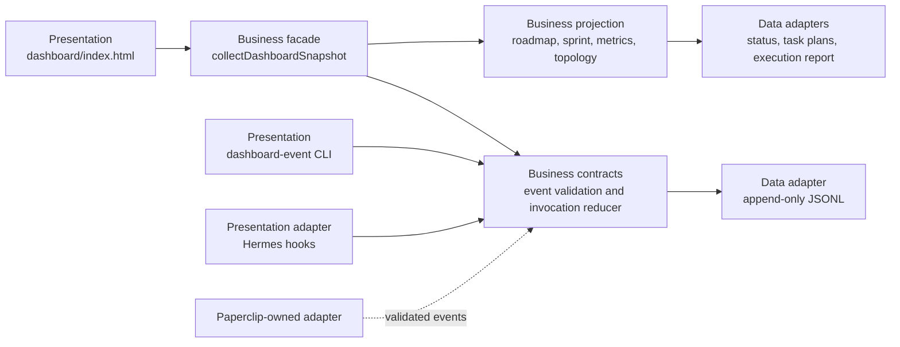
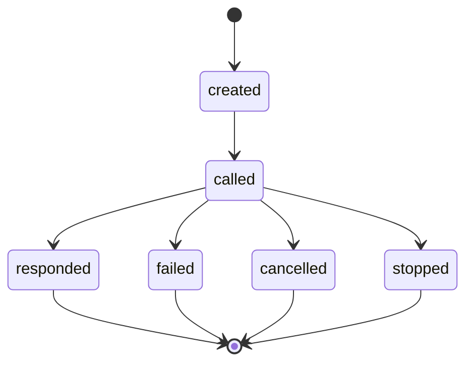

# Dashboard v4 agent constellation architecture

## Purpose and boundaries

Dashboard v4 combines two evidence-backed views without weakening either one:

- product delivery: roadmap, current phase or sprint, WBS progress, Kanban, and verification quality;
- agent execution: parent/child invocation hierarchy, directed call and return traffic, prompt preview metadata, and exact token usage.

The active product baseline remains `work/2D-FPS-game`. The dashboard does not change game code, install Paperclip, call remote providers, or infer unobserved organization data. Existing v3 journal rows remain valid.

## Three-layer structure



Dependencies point from presentation into business contracts. File, report, and journal access are data adapters owned by the snapshot composition root. The dashboard consumes the snapshot and never reconstructs hidden runtime facts from display strings.

## Invocation contract

An invocation row uses `eventType: invocation` and contains this business payload:

```json
{
  invocationId: inv-123,
  parentInvocationId: run-1,
  rootInvocationId: run-1,
  parentAgentId: ultron,
  childAgentId: reviewer,
  stage: called,
  direction: call,
  sequence: 2,
  provenance: {
    provider: runtime,
    reference: hook:subagent-start
  }
}
```

Agent identity is provider-qualified as `<provider>:<agentId>`. Invocation-linked prompts and token dimensions are keyed independently as `<provider>:<invocationId>`, so a runtime call and a Paperclip call can never share evidence merely because their raw IDs match. Runtime agent IDs retain their short display label, while Paperclip agent IDs remain distinct in the data model. `created` and `called` travel parent to child. `responded`, `failed`, `cancelled`, and outcome-unknown `stopped` travel child to parent.



The reducer accepts only monotonic sequence numbers and valid transitions. Explicit adapters can emit `created` then `called`; a runtime hook that first observes `SubagentStart` may truthfully begin at `called`. Duplicate replay with an identical sequence and payload is ignored. Conflicting replay, terminal continuation, orphan parent invocation, or invalid direction is excluded from the invocation projection and reported in `errors.invocations`.

Token usage remains an immutable, exclusive delta keyed by `usageId`. An optional `invocationId` plus required `invocationProvider` links a token delta to a provider-qualified call; it does not change de-duplication. Input and output supplied by the owning provider are `exact`; a total calculated from exact input plus output is `derived`; missing dimensions are `partial` or `unknown`; conflicts remain excluded and surfaced.

### Codex hook evidence boundary

The Codex `SubagentStart` contract provides `session_id`, `turn_id`, `agent_id`, and `agent_type`; `SubagentStop` additionally provides transcript metadata and the latest assistant message, but no parent invocation ID, parent agent type, failure status, or cancellation reason. The Hermes adapter therefore records `codex-session-<session_id> -> codex-agent-<agent_id>` as a `called` edge and records the return as `stopped` (outcome unknown). It never fabricates `created`, nesting, `responded`, `failed`, or `cancelled`. Provider adapters with explicit evidence may still emit the full nested lifecycle.

## Prompt privacy contract

The system never journals a full or raw prompt. `UserPromptSubmit` may emit only:

- a redacted preview of at most 160 Unicode code points;
- `originalLength` and `capturedLength` in Unicode code points;
- `truncated` and `redactionStatus` metadata.

Redaction happens before truncation through one shared Hermes/dashboard utility. API keys (including prefixed environment-variable names and space-separated credential labels), Basic or Bearer credentials, secret/password/token assignments, quoted values, credential URLs, private-key blocks, and known provider-token shapes are redacted. Ambiguous high-risk input is replaced by `[sensitive content omitted]`. Raw tool payloads and full subagent responses remain prohibited. The UI treats an absent or unlinked invocation prompt as unknown and never substitutes the globally latest prompt, task title, or message.

## Paperclip organization contract

Paperclip may attach an `organization` payload to a validated event:

```json
{
  provider: paperclip,
  entityId: agent-42,
  parentEntityId: lead-7,
  organizationId: studio-a,
  team: combat-ai,
  role: reviewer,
  activity: reviewing,
  reference: paperclip:agent-42
}
```

Only values received with a Paperclip provider reference are projected. `PAPERCLIP_URL` alone means `configured · no observed values`; it cannot create nodes, roles, activity, hierarchy, or spatial coordinates. Organization edges are structural and remain visually distinct from evidence-backed live communication edges.

## Roadmap and sprint projection

Source priority is:

1. current phase, delivery status, and next decision from `docs/reports/project-status.md`;
2. task, dependency, and progress from `docs/planning/phase*-tasks.json`;
3. verification quality from `docs/handoffs/current-execution-report.md`;
4. root roadmap material as supplemental context only.

Planning files are grouped by phase number and optional sprint number. A phase-level file is canonical when present; otherwise the phase aggregates its sprint files. Completion is calculated from task statuses. No active sprint means exactly that; the UI displays `활성 스프린트 없음` rather than inventing progress. A next-decision item may add a decision-stage roadmap node without claiming that implementation has begun.

## Tree and animation rules

Invocation call edges define the hierarchy. Paperclip organization edges fill a parent relation only when no invocation parent exists. Generic message and handoff edges remain communication traces but do not rearrange the call tree.

- multiple roots form a forest;
- depth determines the horizontal lane;
- sibling order is creation time then provider-qualified ID;
- cubic paths carry an arrow marker and an explicit stage label;
- fresh call packets travel parent to child and fresh return packets child to parent;
- historical edges remain visible without glow or movement;
- live state requires a fresh invocation event and fresh endpoint runtime evidence;
- `prefers-reduced-motion: reduce` omits motion elements while preserving arrows and text.

Nodes and edges are keyboard selectable and expose direction, stage, endpoints, provider, and live state in their accessible label. A wide forest scales inside its own SVG view box and never widens the page.

## Responsive contract

- Desktop: project summary and metrics stay first; Kanban and agent constellation begin inside the first 1440 x 900 viewport.
- Tablet: product and agent panels stack without document-level overflow.
- Mobile: Kanban, tree, invocation metrics, then trace; only the Kanban may scroll horizontally inside its panel.
- Motion reduction retains a static, fully labeled topology.

## Rejected alternatives

- A force-directed graph was rejected because node positions would move between snapshots and obscure parent/child direction.
- WebGL or a 3D engine was rejected because SVG provides sufficient motion, accessibility, and deterministic tests.
- Fetching Paperclip from the snapshot request was rejected because network latency and credentials would contaminate the local reliability boundary.
- Storing a complete prompt was rejected because observability does not justify secret or conversation retention.
