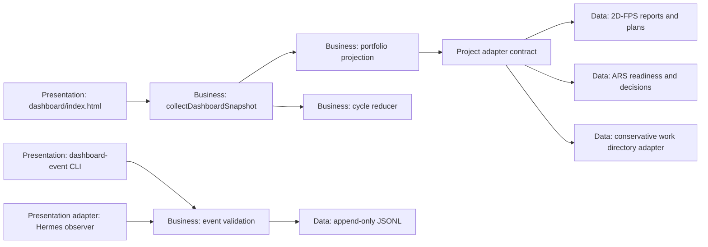
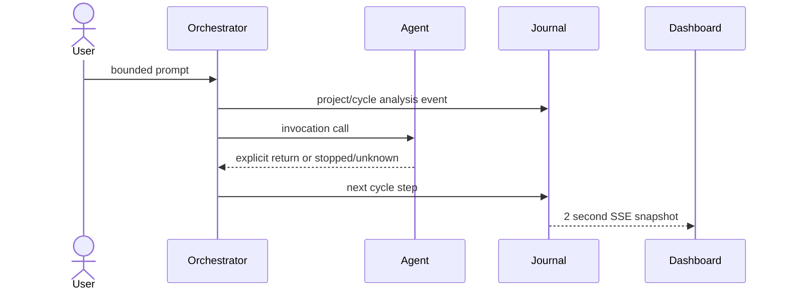

# Dashboard v5 portfolio and orchestration architecture

## Assumptions and constraints

- The executable baseline remains workspace/2D-FPS-game; portfolio discovery does not promote another project to baseline authority.
- Only direct, non-symlink directories under `workspace` are project candidates.
- Unknown progress, completeness, verification, invocation outcome, and pipeline stages stay unknown. They are never rendered as zero or inferred from a directory timestamp.
- The journal remains append-only and stores only bounded, redacted prompt previews and safe summaries.
- The first slice supports deterministic local files and SSE snapshots. Remote RAG retrieval, embeddings, and databases are deferred.

## Layer and component map



Allowed dependencies are Presentation to Business interfaces and Data adapters to Business contracts. The view never parses files or derives hidden runtime facts.

## Project adapter contract

Each adapter returns projectId, displayName, path, baselineRole, status, currentWork, progress, completeness, verification, updatedAt, sources, capabilities, milestones, tasks, quality, and risks.

- progress measures the current declared milestone or plan.
- completeness measures all tasks whose completion meaning the adapter owns.
- ready, research, planned, and blocked tasks are not complete.
- a generic adapter reports discovery and capabilities, but leaves unsupported measurements unknown.
- project-scoped task events may update currentWork only for the matching project and cannot demote durable completed work.

## Cycle event contract

A cycle event has an explicit projectId and cycleId plus:

```text
stepId, predecessorStepId|null, stage, sequence, state,
optional invocationId + invocationProvider, safe summary
```

Stages are analysis, design, design_verification, implementation, implementation_verification, feedback, and revision. Sequence is monotonic per cycle. A predecessor must already exist. Step identity and project identity are immutable. Failed or stopped cycles reject later events.



The cycle map places provider-qualified agent lanes horizontally and the seven stage lanes vertically. The latest fresh non-terminal step and its explicit inbound edge are highlighted. Reduced motion keeps arrows and labels but removes moving effects.

## Lifetime and data flow

The loopback dashboard server owns the snapshot facade and SSE timers. Static collectors keep the existing bounded cache; journal-backed invocation and cycle projections are rebuilt per snapshot. Event append is synchronous and bounded. The browser owns only immutable snapshot state and UI selection.

## Risks and rejected alternatives

- Per-project metadata differs, so the first release uses exact 2D-FPS and ARS adapters plus an unknown-preserving generic adapter.
- Existing rows without projectId remain unassigned and are not backfilled.
- Force layout, iframe reuse, raw prompt storage, filesystem-activity progress inference, and remote retrieval were rejected for determinism, privacy, or evidence quality.

## Implementation slices and gates

1. Add portfolio adapters and project-scoped event fields.
2. Add the cycle reducer, CLI input, and truthful Hermes producer mapping.
3. Add portfolio selection and the two-axis cycle map without removing the v4 invocation forest.
4. Verify unit contracts, isolated browser UX, Hermes producer integration, harness audit, diff check, reviewer pass, and manual drift.
