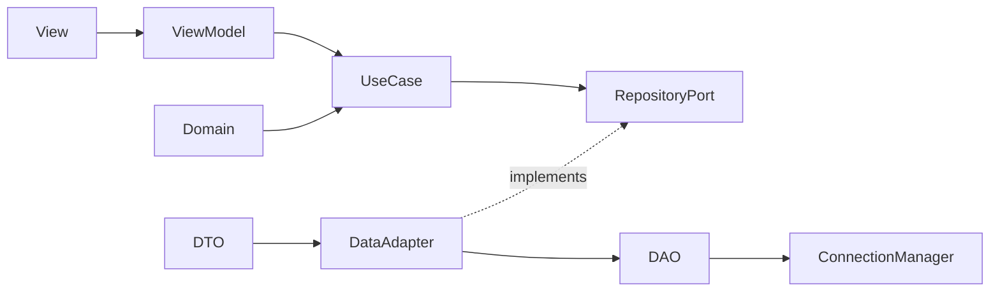
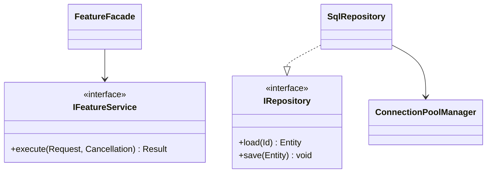
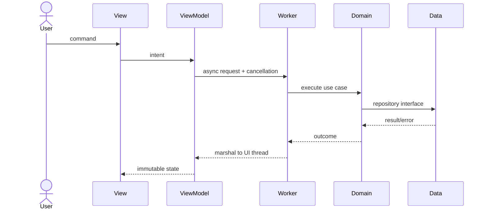

# Architecture Checklist

## Component View

Use this dependency shape unless repository constraints require a documented variant:

Check:

- Presentation owns display state and user intent, not domain policy.
- Business owns protocols, validation, use cases, and domain state.
- Data owns storage/transport details and DTO-to-domain mapping.
- Concrete infrastructure is assembled only at the composition root.

## Class View

Show cardinality, ownership, interface realization, and inheritance. Do not add a base class solely to reduce a few duplicated lines.

## Sequence View

Assign timeout, cancellation, retry, and error translation at each async boundary.

## Schema-First Questions

- What are the tables/collections, primary keys, foreign keys, and uniqueness rules?
- Which invariants belong in the database versus the domain?
- Which queries need indexes, pagination, ordering, or optimistic concurrency?
- What is the migration and rollback path?
- Which operations require a transaction and what isolation level is justified?
- Are DTO fields nullable, versioned, encrypted, or sensitive?
- How are connection exhaustion, timeouts, and transient errors surfaced?

## Decision Record

For each material choice record:

- Context and constraint.
- Chosen option.
- Alternatives rejected.
- Consequences and operational risks.
- Verification evidence.

## Final Gate

- No circular dependency between layers.
- No framework or database type leaks into the domain API.
- Interface contracts cover error and concurrency behavior.
- Schema supports the required access patterns.
- Composition root and disposal order are explicit.
- Diagrams match the planned modules and names.
