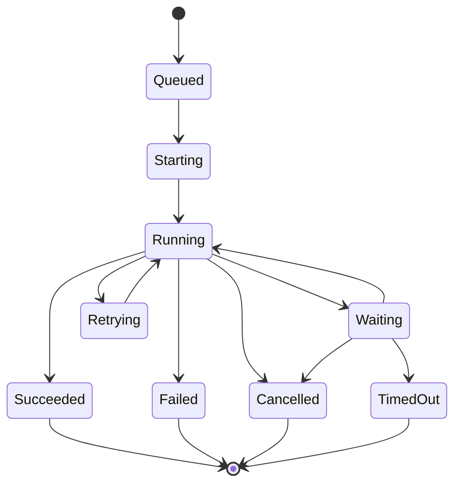

# Verification Log and Status Callback Contract

## Event Model

Every long-running, background, database, collector, agent, or externally visible operation must publish a typed event:

```cpp
enum class OperationState {
    Queued,
    Starting,
    Running,
    Waiting,
    Retrying,
    Succeeded,
    Failed,
    Cancelled,
    TimedOut
};

struct StatusEvent final {
    std::chrono::system_clock::time_point timestamp;
    std::string component;
    std::string operationId;
    std::string correlationId;
    std::optional<std::string> taskId;
    OperationState state;
    std::optional<double> progress;
    std::uint32_t attempt{1};
    std::optional<std::chrono::milliseconds> duration;
    std::optional<std::string> errorCode;
    std::string safeMessage;
    std::thread::id threadId;
};

class IStatusObserver {
public:
    virtual ~IStatusObserver() = default;
    virtual void onStatus(const StatusEvent& event) noexcept = 0;
};
```

Keep domain outcomes in domain result types. The status event is operational evidence, not the business return value.

## Producer Rules

- Generate one stable `operationId` per execution and propagate a caller `correlationId` across layer and thread boundaries.
- Publish `Queued` before dispatch, `Running` after worker acquisition, and exactly one terminal state.
- Publish `Waiting` before blocking on a bounded queue, connection lease, or external dependency.
- Publish `Retrying` with incremented attempt and a safe reason.
- Keep progress monotonic in `[0, 1]`; omit it when total work is unknown.
- Calculate duration from a monotonic clock even when timestamps use the wall clock.
- Never turn a missing value into zero or a disconnected producer into `Running`.

## Observer and Sink Rules

- `NullStatusObserver`: zero-cost fallback for tests or disabled logging.
- `CompositeStatusObserver`: fan out to isolated sinks; one sink failure must not stop the operation or later sinks.
- `StructuredLogObserver`: emit one JSON object per event for deterministic parsing.
- `UiStatusObserver`: enqueue an immutable copy and marshal updates to the UI thread.
- `MetricsObserver`: update counters/histograms without duplicating token or usage deltas.
- Bound queues and define overflow policy. Preserve terminal events and failure events before progress noise.
- Do not call observers while holding domain, connection-pool, or lifecycle locks.

## Structured Log Fields

Use stable field names:

```json
{
  "timestamp": "2026-08-06T12:34:56.789Z",
  "severity": "info",
  "component": "AssetCollector",
  "event": "operation.status",
  "operation_id": "op-...",
  "correlation_id": "corr-...",
  "task_id": "T42",
  "state": "running",
  "progress": 0.5,
  "attempt": 1,
  "duration_ms": 218,
  "thread": "worker-2",
  "outcome": null,
  "error_code": null,
  "message": "Validated 50 of 100 records"
}
```

Add bounded resource indicators only when useful: queue depth/capacity, pool in-use/max, retry count, or batch size. Never include passwords, tokens, authorization headers, connection strings, raw personal data, or unrestricted DTO dumps.

## State Machine



Reject transitions after a terminal state.

## Verification Tests

- Expected start-to-terminal sequence.
- Exactly one terminal event.
- Stable operation/correlation IDs across worker hops and repository calls.
- Monotonic progress and duration.
- Retry attempt ordering.
- Cancellation and timeout terminal states.
- Observer exception containment and composite continuation.
- Concurrent producer safety and per-operation ordering.
- UI observer always applies state on the UI thread.
- Queue overflow retains terminal/failure signals.
- Secret and sensitive-field redaction.
- Structured log schema parsing and timestamp validity.

Include representative events in the execution report, while keeping full logs as artifacts rather than pasting unbounded output into handoffs.
