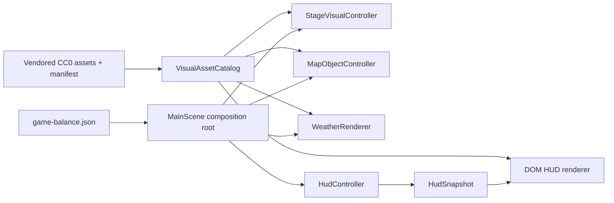
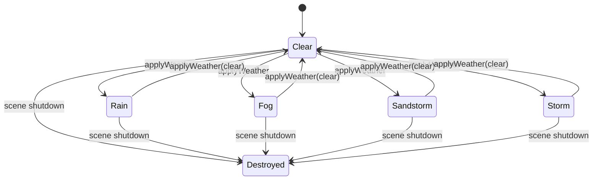

# Phase 9 Architecture - Visual Identity & Readability

- Date: 2026-08-10
- Owner: ultron/codex
- Status: approved for implementation
- Decision: bounded visual/readability slice; gameplay, collision, balance, and progression rules remain unchanged

## Assumptions and Constraints

- Runtime remains Phaser 3 + Vite with the existing DOM HUD composition root in `src/main.ts`.
- Only assets already vendored under `public/assets/source` may be promoted to runtime paths.
- Kenney Top-down Shooter, Kenney UI Pack Sci-Fi, Ground Shaker, and PIXWEP are recorded as CC0 in `public/assets/source/ASSET_MANIFEST.md`; local license files remain preserved.
- Ground Shaker tank bodies and turrets remain the world actors. Kenney operator skins are introduced as HUD identity portraits, not as replacement collision actors.
- The six weapon slots keep their current mechanics and labels. Only their HUD icon mapping changes.
- The five weather types keep their current mechanics. Presentation must make every state immediately distinguishable and fully clear visual state when returning to clear weather.
- `MainScene.ts` remains below the 850-line gate.
- No persistence schema, background thread, or network dependency is added.

## Three-Layer Boundary

| Layer | Responsibility | Files |
| --- | --- | --- |
| Presentation | Render portraits, stage surface, object visuals/legend, weapon icons, and weather atmosphere | `src/main.ts`, `src/styles.css`, `src/scenes/*-renderer.ts`, `src/scenes/*-controller.ts` |
| Business policy | Resolve a typed asset/theme from team, weapon id, stage id, object kind, or weather type; provide one deterministic fallback | `src/domain/visual/VisualAssetCatalog.ts` |
| Data | Vendored CC0 source packs, selected runtime copies, balance stage definitions, and license manifest | `public/assets/source`, `public/assets/runtime`, `assets/data/game-balance.json` |

Presentation may depend on the pure visual catalog. The catalog may depend only on domain types and literal metadata. Data never imports presentation code.

## Contracts

```ts
interface VisualAssetCatalog {
  getOperatorPortraits(team: TeamId | "UNSET"): OperatorPortraitSet;
  getWeaponHudAsset(weaponId: string): WeaponHudAsset;
  getStageVisualTheme(stageId: string): StageVisualTheme;
  getMapObjectVisual(kind: MapObjectKind): MapObjectVisualTheme;
  getWeatherVisualTheme(type: WeatherType): WeatherVisualTheme;
}

interface StageVisualController {
  applyStage(stageId: string): void;
  getDebugState(): StageVisualDebugState;
  destroy(): void;
}
```

The catalog is an immutable module singleton. Scene controllers are scene-lifetime objects created by the `MainScene` composition root and destroyed on scene shutdown. DOM HUD elements are application-lifetime and consume the published immutable HUD snapshot.

## Component View



## Runtime State and Cleanup



`applyWeather(clear)` deactivates every pooled particle and resets fog, atmosphere tint, lightning flash, and flash clock. `destroy()` releases all scene-owned weather and stage visual objects. Map-object tweens and composite visuals are released by the existing controller lifecycle.

## Vertical Slices

1. Typed catalog and asset provenance
   - Remove the misleading loaded-but-unused actor spritesheet configuration.
   - Map operator portraits, all six weapon icons, three stages, six map-object kinds, and five weather states with a deterministic fallback.
2. Actor and loadout identity
   - Show Kenney player/enemy portraits in the HUD while retaining Ground Shaker tank bodies/turrets in the world.
   - Show a distinct mapped icon in the active weapon strip and every weapon slot.
3. Arena and object readability
   - Apply stage-specific terrain crops, tint overlays, and border colors.
   - Render each map-object kind as a coherent composite and show a matching legend.
4. Weather readability
   - Add a continuous state tint plus immediate storm flash and ensure clear resets all effects.
   - Publish the active weather to a HUD pill and stable DOM data attributes for QA.
5. Verification and dashboard closeout
   - Pure catalog/weather tests, focused browser coverage, full gates, status refresh, independent review, and drift check.

## Risks and Mitigations

| Risk | Mitigation |
| --- | --- |
| Strong tints obscure combat | Keep playfield overlays low-alpha and verify all stage/weather combinations visually. |
| DOM legend diverges from world objects | Resolve both from the same typed catalog and test all six entries. |
| A weapon id lacks an icon | One explicit `unknown` catalog fallback; unit test every configured slot and the fallback. |
| Weather state leaks during transitions | Centralized `applyWeather` reset path and clear-transition unit/browser assertions. |
| Scope expands into vehicle mechanics | Tank actors are presentation-only in this phase; no physics, input, or balance changes. |

## Rejected Alternatives

- Replacing tanks with Kenney people in the world: rejected because it weakens the current vehicle combat identity and risks collider/aim alignment regressions.
- Downloading a new live asset pack during the build: rejected because reproducible vendored CC0 sources already cover the scope.
- Encoding paths in `main.ts` and scene controllers: rejected because it would repeat the current scattered-path problem and make fallbacks untestable.
- Expanding Phase 9 into drivable vehicles or a new progression loop: rejected as a separate product slice.

## Acceptance and Verification

- Unit: catalog completeness, unique configured weapon mappings, source provenance, stage theme fallback, weather theme coverage, and clear reset state.
- Browser: both operator portraits load, six slot icons match catalog, three stage identities change, six object legend entries match world kinds, five weather identities update, and no console errors occur.
- Full: type-check, lint, unit, build, Playwright, MainScene LOC, project status, postflight, independent review, and manual drift check.
