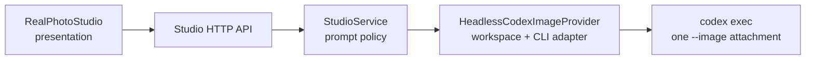

# Reference-guided photorealistic UX redesign

## Decision

Keep one trusted-local Codex image-generation call per user request. In 2D-to-photo mode, the attached original raster remains the sole visual attachment. The user selects which allowed visual domains to preserve, while the user story remains authoritative for the action, emotion, event, and intentional scene change. The system does not claim automatic image recognition, identity matching, OCR, pixel copying, or a provider-native similarity score.

## Constraints and failure model

- The browser sends one original PNG/JPEG/WebP under 6 MB only for 2D-to-photo mode. The source is staged in a disposable workspace and never returned or recorded in an audit entry.
- The local process sends the staged source once with `codex exec --image`; text-to-photo requests never attach an image.
- Safety, original-content, fictional-adult, and non-identifying constraints override every other direction.
- A provider model may still interpret visual continuity imperfectly. The product communicates a requested preservation plan, not a similarity guarantee.
- The existing server-owned 5% ETA, 90% finalization, and terminal-only 100% state machine remains unchanged.

## Layer and component contract



- Presentation owns selected mode, source preview, focus chips, story text, output choice, and render-only job state.
- `StudioService` validates focus selections and composes the immutable request brief. It owns story/reference precedence and never reads source bytes after validation.
- `HeadlessCodexImageProvider` owns staging, the single Codex command, returned-raster validation, GIF encoding, and workspace deletion.

The new API field is `referenceFocus` and is valid only in `animation_2d_to_photo` mode:

```text
preserveSubjectVisuals: boolean
preserveBackgroundLayout: boolean
preserveCameraComposition: boolean
```

All three default to `true` when omitted for backward-compatible 2D requests. The field is an authoring intent, not extracted source metadata, and is omitted from text-only jobs.

## Prompt precedence and data flow

```mermaid
sequenceDiagram
  actor U as User
  participant UI as RealPhotoStudio
  participant S as StudioService
  participant P as Provider
  U->>UI: select original 2D image + focus + story
  UI->>S: validated draft and source bytes

  S->>S: build safety > story > selected-reference contract
  S->>P: composed brief + ephemeral source
  P->>P: stage source and invoke one codex exec --image
  P-->>S: validated still/GIF or safe failure
  S-->>UI: lifecycle snapshot; 100 only at terminal success
```

Prompt ordering is fixed:

1. hard safety, rights, adult-only, and no-likeness constraints;
2. structured conditions plus the user story's subject, action, emotion, event, and intended change;
3. only the selected non-conflicting reference domains: fictional silhouette/clothing palette, background layout/lighting, and camera framing/perspective;
4. photorealistic rendering constraints.

## UI contract

`/real` is a five-step Korean authoring flow. The step rail is informational; inputs remain in one form so keyboard navigation and a single submit action are preserved.

1. **Mode and data boundary.** The author chooses text-to-photo or 2D-to-photo before entering a request. The 2D card states that one original is attached to the local signed-in Codex request and staged only temporarily.
2. **Reference focus (2D only).** After an original is attached, the author can retain or remove three requested anchors: character visual traits, background layout and lighting, and camera composition. The preview is an upload confirmation only. Labels explicitly say that the chips are requested preservation intent, not image-recognition output or a similarity result. At least one focus chip must remain active.
3. **Visual conditions.** Structured adult-safe scene fields constrain the render brief independently of the uploaded raster.
4. **Story direction.** The story composer explicitly asks for subject, action, emotion, event, and desired scene change. The render-contract preview renders the order `safety -> story -> selected reference anchors -> photoreal rendering`, so an author can predict conflict resolution before submitting.
5. **Output plan and result.** Still/GIF selection, rights attestation, submission, live status, and final output live together. The raw source bytes, staged path, and raw provider invocation are never rendered.

Accessibility requirements:

- focus chips are native buttons with `aria-pressed`; their group is a `fieldset` with a `legend`;
- the source egress notice remains connected to the rights checkbox through `aria-describedby`;
- lifecycle updates use an `aria-live="polite"` result region and an accessible progressbar;
- purely decorative activity and finalization indicators are hidden from assistive technology, and animation follows the existing reduced-motion rule.

## Progress and completion contract

The redesign preserves the server-owned progress model. It does not represent a provider model-render percentage and does not fabricate a provider ETA.

- Before a real terminal event, elapsed-time forecasts are quantized in 5% increments and capped at 90%.
- At 90%, the progress bar holds while the completion-finalization panel names the real server state: waiting for provider output, validating the image, encoding GIF frames, or saving the artifact.
- Only a validated terminal artifact transitions to 100%. A failed or over-estimate job remains below 100% and renders the provider failure.

## Verification and manual quality gate

Deterministic tests verify default/invalid focus handling, story precedence in the composed prompt, one pre-positional `--image` attachment, source-byte non-retention, text-mode reference removal, selected-focus API payloads, and the retained 90%-finalization/terminal-100 behavior.

Live visual fidelity cannot be proved by those contract tests. On a trusted local machine, an operator must use one rights-held, non-identifying 2D fixture with two materially different stories and inspect both outputs:

- selected silhouette/clothing, background layout, and camera framing remain recognizable only where selected;
- the two stories produce their requested action, emotion, event, and intentional scene change;
- no real-person likeness, logo, readable text, watermark, or unowned character is present.

This is a manual quality gate because the provider has no deterministic similarity score or model-render telemetry available to the local application.
