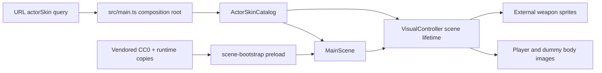
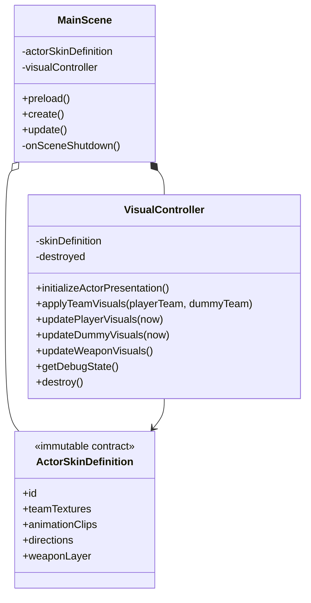
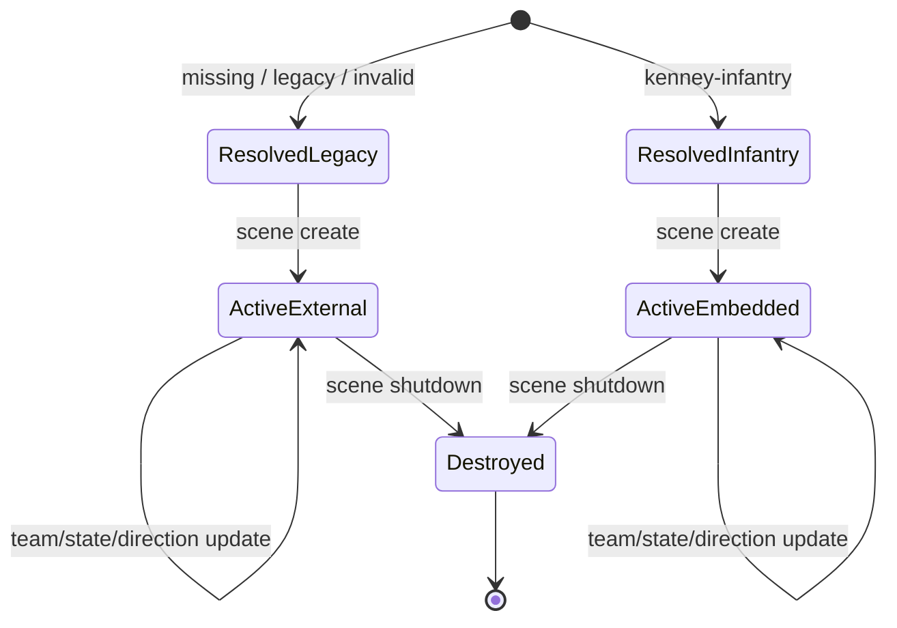

# Phase 10 Architecture - Character Skin Foundation POC

- Date: 2026-08-12
- Owner: ultron/codex + product_owner
- Status: approved for implementation
- Decision: keep the Ground Shaker vehicle presentation as the default and fallback while proving a URL-selectable, vendored Kenney infantry presentation path
- Research basis: `./phase10-2.5d-skin-research.md`

## Goal and Constraints

Establish the runtime contract and presentation ownership needed for a future eight-direction 2.5D character atlas without downloading assets or changing gameplay. The POC uses the already-vendored Kenney CC0 static infantry art only to prove selection, team swapping, embedded-weapon policy, lifecycle cleanup, and deterministic fallback behavior.

- The executable baseline remains Phaser 3 + TypeScript + Vite in `workspace/2D-FPS-game`.
- Missing, legacy, or invalid `actorSkin` query values resolve to `legacy-vehicle`.
- `?actorSkin=kenney-infantry` opts into the static infantry POC.
- Collision bounds, positions, aim geometry, combat values, weather rules, progression, and persistence remain unchanged.
- The POC must represent idle, run, fire, hit, and death states plus eight directions in a Phaser-independent contract, but every POC state intentionally maps to the same static team texture.
- `MainScene.ts` remains at or below 850 lines.
- No database, worker, network request, retry, cancellation, or schema change is introduced.

## Three-Layer Boundary

| Layer | Responsibility | Planned files |
| --- | --- | --- |
| Presentation | Read the URL at the application composition root, preload runtime textures, create scene objects, apply actor skin presentation, and dispose scene-lifetime presentation state | `src/main.ts`, `src/scenes/MainScene.ts`, `src/scenes/scene-bootstrap.ts`, `src/scenes/visual-controller.ts` |
| Business policy | Define immutable skin, source, state, direction, team-texture, fallback, rotation, scale, and weapon-layer contracts with deterministic resolvers | `src/domain/visual/ActorSkinCatalog.ts` |
| Data | Preserve the CC0 source files and promote only the two selected static POC textures to runtime delivery paths | `public/assets/source/kenney-top-down-shooter`, `public/assets/runtime/sprites` |

Dependencies point from Presentation to the Phaser-independent Business contract. The Business module contains paths and literal metadata but imports no Phaser or browser scene types. Data files import no code.

## Interface Contracts

```ts
type ActorSkinId = "legacy-vehicle" | "kenney-infantry";
type ActorAnimationState = "idle" | "run" | "fire" | "hit" | "death";
type ActorDirection = "east" | "south-east" | "south" | "south-west" |
  "west" | "north-west" | "north" | "north-east";
type ActorWeaponLayerPolicy = "external" | "embedded";

interface ActorSkinDefinition {
  readonly id: ActorSkinId;
  readonly sourceId: "ground-shaker" | "kenney-top-down-shooter";
  readonly fallbackId: "legacy-vehicle";
  readonly bodyScale: number;
  readonly rotationOffsetRadians: number;
  readonly weaponLayer: ActorWeaponLayerPolicy;
  readonly teamTextures: Readonly<Record<TeamId, ActorTeamTexture>>;
  readonly animationClips: Readonly<Record<ActorAnimationState, ActorAnimationClip>>;
  readonly directions: readonly ActorDirection[];
}

interface ActorPresentationDebugState {
  readonly skinId: ActorSkinId;
  readonly weaponLayer: ActorWeaponLayerPolicy;
  readonly playerState: ActorAnimationState;
  readonly dummyState: ActorAnimationState;
  readonly playerDirection: ActorDirection;
  readonly dummyDirection: ActorDirection;
  readonly destroyed: boolean;
}
```

- `getActorSkinDefinition(requestedId)` is synchronous, total, idempotent, and returns `legacy-vehicle` for null, blank, legacy aliases, or unknown ids.
- `resolveActorAnimationState(input)` uses the deterministic priority `death > hit > fire > run > idle`.
- `resolveActorDirection(angleRadians)` normalizes any finite angle to the nearest of eight screen-space directions and returns `east` for non-finite input.
- Every team texture names a preload key, runtime path, source path, and CC0 source id. Tests can replace neither Phaser nor a scene to validate the contract.
- `VisualController` consumes one immutable definition, owns actor body/weapon presentation after `MainScene.create`, and has an idempotent `destroy` called during scene shutdown. Scene-created Phaser objects remain owned and disposed by Phaser.

## Component View



## Class and Lifetime View



The application resolves the immutable definition once. `MainScene.create` constructs a new `VisualController` after the actor body and weapon objects exist, initializes presentation, and owns it until shutdown. Shutdown calls controller destruction before Phaser releases scene objects. A subsequent page/application construction creates a fresh scene and controller. In-place Phaser scene restart remains outside this POC because pre-existing scene managers are not restart-safe. There is no asynchronous work or shared mutable state.

## Presentation State



## Failure and Fallback Rules

- Unknown query values never reach Phaser as texture keys; they resolve to the legacy definition first.
- Runtime asset existence is verified in unit tests. A missing promoted file is a build/test failure, not a silent runtime substitute.
- `legacy-vehicle` keeps external Ground Shaker turrets visible and preserves the current rotation offset and body scale.
- `kenney-infantry` uses weapon-embedded static textures, so external turrets remain hidden while combat logic continues unchanged.
- Static clip metadata is honest: it proves state compatibility but does not claim animation, 2.5D quality, bundle, or frame-time acceptance.

## Rejected Alternatives

- Make infantry the default: rejected because the static source is a contract POC and would regress the completed Phase 9 vehicle identity.
- Download Quaternius or a paid pack now: rejected because the research did not authorize downloads or purchases and the production atlas pipeline is a separate slice.
- Put query parsing and texture paths directly in `MainScene`: rejected because it scatters policy and makes fallback tests require Phaser.
- Add persistence or a settings toggle: rejected until the animated POC proves the product direction.
- Add live 3D or `Light2D`: rejected until baked-atlas readability and cost are measured.

## Ordered Slices and Acceptance

1. Contract and assets: add the typed catalog, static clip/direction/state resolvers, and two traceable runtime copies.
2. Scene integration: resolve the URL in `main.ts`, preload both POC textures, create/destroy the controller per scene, and apply body/weapon policy without gameplay changes.
3. Verification: focused unit and browser tests for fallback, team swapping, weather visibility, scene shutdown plus page restart cleanup, screenshots, and zero console errors.
4. Closeout: run full gates, refresh Phase 10 status/handoff, obtain independent review, and run drift/postflight.

The next separate product decision is whether to vendor Quaternius CC0 sources and automate Blender output for a real eight-direction animated POC. That slice must set atlas dimensions, frame counts, bundle/GPU budgets, and performance acceptance before implementation.
