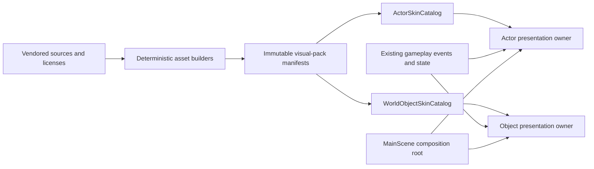

# Phase 11-13 Roadmap - Visual Productization Vertical Slice

- Date: 2026-08-14
- Owner: product + product_owner + ultron/codex
- Status: product goal approved; Phase 11 implementation pending
- Active workspace: `workspace/2D-FPS-game`
- Current executable baseline: Phase 10, with `legacy-vehicle` still selected on `/`

## Product Goal

Turn the feature-complete test harness into a coherent, saleable-looking top-down arena-shooter vertical slice. Within the first ten seconds on the default `/` route, a player must see authored characters, authored world objects, and responsive state animation that belong to one visual language.

This roadmap defines a product-quality target, not a claim that the game is commercially complete. Gameplay rules remain the verified baseline while presentation is replaced around them.

## Current Gap

| Surface | Current runtime | Product gap |
| --- | --- | --- |
| Characters | Ground Shaker vehicles are the default; Kenney infantry is a hidden static opt-in | No default animated character identity |
| World objects | Six map-object kinds and several arena props are composed from circles, rectangles, colors, glyphs, and labels | Readable as a harness, not as authored game art |
| Motion | Weapon, weather, and a few tween effects exist; character clips are static and object state art is absent | Combat states lack authored motion and feedback cohesion |
| Delivery state | Phase 11 has an approved contract but no source, generator, atlas, or runtime integration | Planning evidence has not produced a user-visible improvement |

## Target-Frame Gate

Before locking the Phase 12 object source pack, produce one fixed 960x540 target frame that shows a BLUE actor, a RED actor, representative hard cover, barrel, crate, pickup, teleporter, gate, and one weather treatment. Product approval must lock:

- top-down projection and sprite scale;
- material, outline, shadow, and palette rules;
- actor-to-object contrast and team accents;
- the maximum acceptable amount of UI-like glyph or text in the world.

Asset production may not mix unrelated packs merely because each individual asset is licensed or technically convenient. The target frame is the visual contract for later screenshots.

## Roadmap

| Phase | Outcome | Entry gate | Exit gate | Default route |
| --- | --- | --- | --- | --- |
| Phase 11 - Animated Character Delivery | Quaternius BLUE/RED actors with five states, eight directions, and independent carbine aim | Current approved Phase 11 contract | Existing T1-T5 provenance, reproducibility, animation, readability, performance, and review gates pass | Remains legacy; animated actor is opt-in |
| Phase 12 - Authored Object Skin Kit | Eleven visible object families use authored skins from one art direction | Phase 11 reviewer pass and approved target frame | Every inventory item is skinned in all three stages; production presentation no longer depends on debug shapes or glyphs | Product pack remains opt-in |
| Phase 13 - State Animation and Default Promotion | Actor, object, interaction, and combat feedback form one responsive motion system | Phase 12 reviewer pass | Integrated visual, lifecycle, screenshot, performance, and fallback gates pass | Product pack becomes default; legacy remains explicit total fallback |

The phases are intentionally sequential. Phase 11 stays character-only so the first real runtime delivery is not delayed by the object inventory. Phase 12 and Phase 13 receive detailed architecture/WBS contracts only after the preceding runtime phase passes.

## Authored Object Inventory

Phase 12 covers 11 player-visible families:

1. Blast barrel.
2. Proximity mine.
3. Supply crate.
4. Breakable cover.
5. Bounce wall.
6. Teleporter.
7. Arena obstacle family, including core, tower, and barrier variants.
8. Service gate.
9. Vent and hazard-surface family.
10. Ammo pickup.
11. Health pickup.

Collision primitives may remain invisible implementation details. In production presentation, circles, rectangles, single-letter glyphs, `VENT`/`COVER` labels, and percentage text may be used only by an explicit QA overlay, never as the primary visual identity.

## Product Acceptance

### Character gate

- Exactly two teams x five states x eight directions and 176 stable frame keys per team.
- Actual Phaser playback for `idle`, `run`, `fire`, `hit`, and `death`; no state may alias a static frame.
- State priority is `death > hit > fire > run > idle`.
- Movement direction and aim direction remain legible when they differ by at least 90 degrees.
- Phase 11 retains its stricter limits: at most 8 MiB transfer, 32 MiB raw GPU estimate, p95 at most 16.7 ms, and at most +1.0 ms versus legacy.

### Object gate

- Authored-skin coverage is 100% for the 11 families across all three stages.
- Each object exposes the applicable subset of `idle`, `active`, `damaged`, `disabled`, and `destroyed` presentation states.
- Existing collider, interaction bounds, damage, cooldown, and spawn-position values remain unchanged.
- Team, hazard, pickup, and traversal affordances remain readable without world text.

### Animation gate

- Required responses include mine arm/trigger, barrel explosion, crate and cover damage/destruction, bounce impact, teleport transfer, gate open/close, vent activation, and pickup collect/respawn.
- One-shot clips do not restart or overlap from duplicate event delivery.
- A presentation response starts no later than the render frame following its gameplay event.
- Twenty stage/weather transitions leave zero orphan tweens, duplicate animation keys, or live scene controllers.

### Integrated product gate

- The final visual pack is selected on `/` without a query parameter; an explicit legacy option restores the complete fallback.
- A deterministic 3-stage x 5-weather screenshot matrix contains no missing textures or production debug geometry.
- Console and page errors are zero.
- Combined product visual-pack transfer is at most 12 MiB and estimated raw GPU textures are at most 64 MiB.
- The fixed 960x540 storm scene remains at or below 16.7 ms p95 and at most +1.5 ms versus the current legacy baseline.
- Independent review scores art cohesion, actor focus, team readability, object affordance, and state readability at least 4/5 in every category.

## Architecture Boundaries

| Layer | Responsibility | Planned ownership |
| --- | --- | --- |
| Presentation | Preload immutable manifests, create scene-lifetime actor/object views, select clips, apply transforms, and dispose textures/tweens/controllers | extracted actor composition, `VisualController` successor, `MapObjectController`, `StageGeometryManager`, scene composition root |
| Business | Define pack selection, actor and object skin contracts, state priority, fallback, anchors, scale, clip metadata, and budget validation without Phaser types | `ActorSkinCatalog`, new `WorldObjectSkinCatalog`, pure manifest validators |
| Data/build | Preserve source/license/hash evidence and produce immutable runtime atlases/manifests with deterministic tools | `public/assets/source`, build adapters under `tools`, `public/assets/runtime` |



The catalogs own presentation policy but do not own damage, collision, cooldowns, spawning, or balance. Runtime code never imports Blender, encoder, or source-model types. There is no persistence schema or network acquisition in this program.

### Boundary contracts

```ts
type VisualPackId = "legacy" | "product-v1";
type ObjectPresentationState = "idle" | "active" | "damaged" | "disabled" | "destroyed";

interface WorldObjectSkinDefinition {
  readonly kind: MapObjectKind | ArenaPropKind;
  readonly textureKey: string;
  readonly anchor: Readonly<{ x: number; y: number }>;
  readonly scale: number;
  readonly clips: Readonly<Partial<Record<ObjectPresentationState, AnimationClipDefinition>>>;
  readonly fallback: WorldObjectSkinDefinitionRef;
}

interface VisualPackManifest {
  readonly id: VisualPackId;
  readonly sources: readonly ProvenanceRecord[];
  readonly actorManifest: string;
  readonly objectManifest: string;
  readonly transferBytes: number;
  readonly estimatedGpuBytes: number;
}
```

One scene-lifetime owner is responsible for each actor or object presentation. The composition root creates owners after preload and destroys them before Phaser releases scene objects. Missing, incomplete, or over-budget product manifests activate the total legacy pack; mixed partial activation is forbidden.

## Ordered Delivery

1. Capture the current default screenshot, transfer/GPU estimate, frame-time sample, and collider/bounds baseline.
2. Execute Phase 11 T1-T5 unchanged: provenance, deterministic generator, actor composition extraction, opt-in runtime, and verification.
3. Approve the target frame, then create the Phase 12 architecture, WBS, source inventory, and `WorldObjectSkinCatalog` contract.
4. Deliver Phase 12 as repeated vertical slices: catalog -> preload -> presentation -> focused test, then expand to all 11 families and three stages.
5. Create and execute the Phase 13 event-to-animation contract, integrated screenshot/performance suite, and default-promotion migration.
6. Synchronize task JSON, project status, handoff, active baseline, reviewer evidence, drift, and postflight after every runtime phase.

## Delivery Rules

- A documentation-only contract is planning progress, not a visual improvement.
- A visual phase cannot be called complete without runtime evidence from its current workspace fingerprint.
- A hidden query option is a QA milestone, not a product-delivery endpoint.
- Default promotion occurs only once, in Phase 13, after the complete pack passes the integrated gate.
- User approval is required for the target frame and final default-promotion capture.

## Risks and Non-Scope

Primary risks are mixed art direction, sprite/collider mismatch, weather readability loss, atlas/GPU growth, scene-lifetime leaks, and leaving improvements permanently hidden behind opt-in flags. Each is bound to the target-frame, baseline-preservation, budget, lifecycle, or promotion gate above.

This program excludes new gameplay rules, balance changes, maps, weapons, modes, skin commerce or persistence, paid assets, live 3D, normal maps, `Light2D`, and a full HUD redesign.
