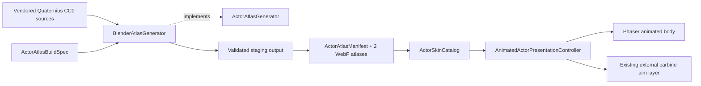
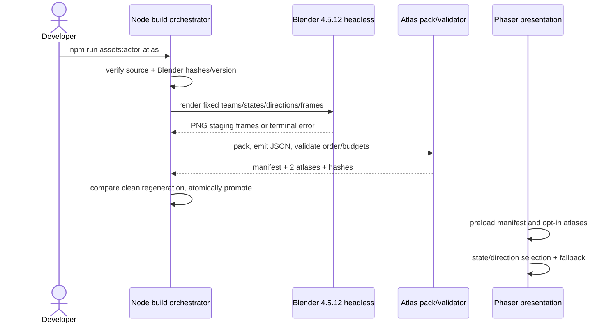

# Phase 11 Architecture - Quaternius Animated Character POC

- Date: 2026-08-13
- Owner: vision/product + product_owner + ultron/codex
- Status: contract approved; implementation pending
- Decision: vendor the Quaternius Universal Base Characters and Universal Animation Library CC0 free-core downloads, then generate a deterministic two-atlas web POC through pinned headless Blender
- Previous phase: Phase 10 Character Skin Foundation POC (complete)

## Assumptions and Constraints

- The executable baseline remains Phaser 3.90 + TypeScript + Vite in `workspace/2D-FPS-game` at a fixed 960x540 playfield.
- Ground Shaker vehicles remain the default and total fallback. The animated infantry POC stays opt-in until its budgets and readability gates pass.
- The approved source is the free-core [Quaternius Universal Base Characters](https://quaternius.com/packs/universalbasecharacters.html) plus [Universal Animation Library](https://quaternius.com/packs/universalanimationlibrary.html). Both official pages displayed CC0 and personal/commercial use permission when re-verified on 2026-08-13.
- Acquisition must re-verify the official-page license, download URL, and available free-core contents, then record the acquisition date and SHA-256 hashes. This contract does not download or vendor the packs.
- Blender is pinned to `4.5.12 LTS` for the POC. The implementation records the executable/archive SHA-256 and rejects any other version instead of silently producing different output.
- `MainScene.ts` is already 848/850 lines. Runtime integration cannot add scene composition code until actor-presentation construction/lifecycle wiring is extracted.
- Collision, combat, weapon values, stage content, weather rules, progression, persistence, and input semantics do not change.
- No live 3D renderer, paid asset, normal map, `Light2D`, skin store, or all-six-weapons expansion is included.

## Product and Quality Requirements

The POC proves one BLUE and one RED infantry material variant, one externally aimed carbine presentation, five animation states, and eight body directions. Body locomotion follows movement direction; the external carbine continues to expose aim direction so aim and movement can differ visibly. Fire may temporarily select an aim-directed body clip, then returns to the locomotion state.

| State | Frames/direction | Rate | Repeat | Frames/team |
| --- | ---: | ---: | --- | ---: |
| idle | 4 | 6 fps | yes | 32 |
| run | 6 | 12 fps | yes | 48 |
| fire | 4 | 12 fps | no | 32 |
| hit | 2 | 12 fps | no | 16 |
| death | 6 | 8 fps | no | 48 |
| **Total** | **22** | - | - | **176** |

Direction order is `east`, `south-east`, `south`, `south-west`, `west`, `north-west`, `north`, `north-east`. Team order is `BLUE`, then `RED`. Frame order is state, direction, then zero-based frame number.

## Web Budgets

| Budget | Limit | Measurement |
| --- | ---: | --- |
| Atlas count and dimensions | at most 2 x 2048x2048 | one color atlas per team |
| Frame cell | 128x128 | 16 columns x 11 occupied rows = 176 frames/team |
| Opt-in transfer | at most 8 MiB combined | both WebP atlases plus Phaser JSON, uncompressed HTTP response bytes |
| GPU texture memory | at most 32 MiB combined | `2 x 2048 x 2048 x 4` RGBA bytes; mipmaps disabled |
| Fixed-scene frame time | p95 at most 16.7 ms | 960x540, one player, one dummy, storm, fixed 30-second sample after warm-up |
| Regression from legacy | p95 increase at most 1.0 ms | same browser, machine, scene, sample length, and build |
| Runtime correctness | zero console/page errors | focused and full Playwright runs |

The generated atlas images use alpha-capable WebP with Phaser-compatible JSON. Intermediate renders may be PNG but never ship in `public/assets/runtime`. The generator fails when any count, dimension, transfer, or raw-memory limit is exceeded.

## Three-Layer Boundary

| Layer | Responsibility | Planned locations |
| --- | --- | --- |
| Presentation | Load opt-in atlases, select state/direction, keep the carbine aim layer independent, expose QA state, and dispose scene-lifetime objects | extracted actor presentation composition, `src/scenes/visual-controller.ts`, `src/main.ts` |
| Business policy | Extend the Phaser-independent actor catalog with the animated skin, manifest contract, state priority, direction policy, fallback, and budget validation | `src/domain/visual/ActorSkinCatalog.ts`, focused pure tests |
| Data/build adapter | Preserve CC0 source/provenance, drive pinned Blender headlessly, render/pack frames, hash outputs, and emit the immutable manifest | `public/assets/source/quaternius-*`, `tools/actor-atlas`, `public/assets/runtime/actors` |

Presentation depends only on Business contracts. The Blender adapter implements the build interface and emits files described by the Business manifest; runtime code never imports Blender/Python types or source models. The source and generated data import no runtime code.

## Interface and Manifest Contracts

```ts
interface ActorAtlasBuildSpec {
  readonly schemaVersion: "1.0.0";
  readonly blenderVersion: "4.5.12";
  readonly teams: readonly ["BLUE", "RED"];
  readonly states: Readonly<Record<ActorAnimationState, {
    readonly framesPerDirection: number;
    readonly frameRate: number;
    readonly repeat: boolean;
  }>>;
  readonly directions: readonly ActorDirection[];
  readonly cell: { readonly width: 128; readonly height: 128 };
  readonly atlas: { readonly width: 2048; readonly height: 2048; readonly maxCount: 2 };
}

interface ActorAtlasGenerator {
  generate(spec: ActorAtlasBuildSpec): Promise<ActorAtlasManifest>;
}

interface ActorAtlasManifest {
  readonly schemaVersion: "1.0.0";
  readonly source: readonly {
    readonly id: string;
    readonly officialUrl: string;
    readonly acquiredAt: string;
    readonly license: "CC0-1.0";
    readonly sha256: string;
  }[];
  readonly generator: {
    readonly blenderVersion: "4.5.12";
    readonly blenderSha256: string;
    readonly scriptSha256: string;
  };
  readonly frames: readonly {
    readonly key: string;
    readonly team: "BLUE" | "RED";
    readonly state: ActorAnimationState;
    readonly direction: ActorDirection;
    readonly index: number;
  }[];
  readonly atlases: readonly {
    readonly team: "BLUE" | "RED";
    readonly imagePath: string;
    readonly jsonPath: string;
    readonly imageSha256: string;
    readonly transferBytes: number;
  }[];
}
```

The boundary command is `npm run assets:actor-atlas`. It performs no network access, deletes only its validated generated staging directory, rebuilds from vendored inputs, validates the manifest and budgets, and atomically promotes successful output. It is idempotent: two clean generations from identical inputs must produce byte-identical atlases, JSON, and hashes.

Frame keys use `actor/{team-lower}/{state}/{direction}/{frame-two-digits}`, for example `actor/blue/run/north-east/03`. Missing inputs, version mismatch, render failure, duplicate/missing frame keys, budget overflow, or hash mismatch are terminal errors. There is no automatic retry, timeout hiding, or fallback output from the generator. Cancellation belongs to the invoking shell/CI process; partial output remains confined to staging and is never promoted.

## Component View



## Build and Runtime Sequence



## Lifetime, Threading, and Data Flow

- The build is an offline single-process orchestration; Blender may use its internal workers, but output ordering comes only from the fixed manifest order.
- Vendored source packs are repository-lifetime inputs. Staging is command-lifetime and disposable. Promoted atlases/manifests are immutable build artifacts. The animated presentation controller is scene-lifetime and is destroyed before Phaser releases scene objects.
- The runtime performs no network acquisition, asset mutation, background worker, retry, or persistent write.
- Missing or invalid animated metadata resolves to `legacy-vehicle`; it never partially activates one team or an incomplete atlas.

## Readability Acceptance

- BLUE and RED differ by value/pattern/silhouette accent as well as hue.
- Body movement direction and independent carbine aim direction remain legible when they differ by at least 90 degrees.
- Idle, run, fire, hit, and death are distinguishable at gameplay zoom.
- Clear, rain, fog, sandstorm, and storm each receive deterministic BLUE and RED screenshots at 960x540.
- The actor, aim, and team identity remain readable without changing weather mechanics or increasing actor collision bounds.

## Risks and Rejected Alternatives

- **Source/free-core contents can change:** re-verify official pages and hash exact downloads before vendoring.
- **128px cells may lose detail:** accept only if fixed-zoom screenshots pass; increasing cells would violate the two-atlas GPU budget and requires a new decision.
- **WebP output can vary across tool versions:** pin Blender and every packer/encoder dependency, then require byte-identical clean regeneration.
- **Make infantry the default:** rejected until animation, performance, and readability gates pass.
- **Live 3D or normal maps/`Light2D`:** rejected because they widen runtime and GPU risk before the baked-color POC is proven.
- **Lower/upper-body atlas compositing:** rejected for this first animated slice because it multiplies render/runtime complexity; the external carbine preserves aim/movement separation within the two-atlas budget.
- **Paid military art:** rejected for the POC because CC0 provides a distributable, auditable baseline.

## Ordered Implementation Slices

1. Vendor the two re-verified free-core CC0 sources and license/provenance records with SHA-256 hashes.
2. Add the pinned, one-command headless generator, stable manifest schema, staging/atomic promotion, and byte-identical regeneration test.
3. Extract actor presentation composition before adding animated catalog/runtime selection and scene-lifetime playback.
4. Add deterministic catalog, animation, fallback, budget, browser readability, console, and fixed-scene performance gates.
5. Run full static/unit/build/browser gates, current-fingerprint review, drift, postflight, and status synchronization.

No Phase 11 runtime implementation is authorized to claim completion until every slice and acceptance gate in `phase11-wbs.md` passes.
