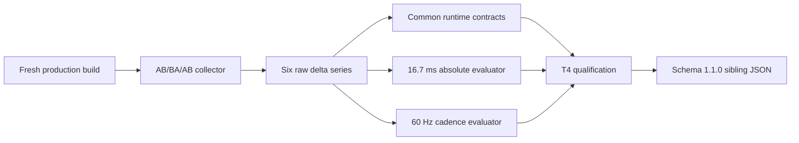

# Phase 11 Display-Cadence Qualification Architecture

- Date: 2026-08-20
- Decision: product-owner approved explicit 60 Hz D3D11 qualification
- Scope: performance evidence schema and T4 decision only
- Non-goal: rewriting the measured `16.9 ms` p95 as an absolute `16.7 ms` pass

## Assumptions and constraints

- The six existing 30-second captures are hardware D3D11 requestAnimationFrame measurements at a nominal 60 Hz display cadence.
- Legacy and animated both measured p50 `16.7 ms`, p95 `16.9 ms`, with every animated-minus-legacy delta at `0.0 ms`.
- The original absolute contract remains visible and independently evaluated.
- A display-cadence exception may qualify T4 only when all six captures prove stable single-refresh delivery and the animated route adds no material regression.
- The original performance report remains immutable evidence. The new run writes a sibling report.

## Evidence contract

The report schema advances to `1.1.0` and keeps raw frame deltas. It adds:

```ts
interface PerformanceQualification {
  readonly absolutePassed: boolean;
  readonly cadenceQualified: boolean;
  readonly qualification: "absolute" | "display-cadence-exception" | "failed";
  readonly absoluteFailures: readonly string[];
  readonly cadenceFailures: readonly string[];
}
```

The display-cadence exception requires all of the following:

- exactly six AB/BA/AB captures on hardware D3D11;
- at least `1790` frame deltas per 30-second capture;
- p50 within the declared 60 Hz cadence band and p95 at most `16.9 ms`;
- zero frame deltas greater than `25 ms`;
- every animated-minus-legacy p95 delta at most `1.0 ms`;
- zero console, page, request, HTTP, unhandled-rejection, visibility, scene, texture, transfer, or GPU contract failure.

`absolutePassed` remains false whenever an animated p95 exceeds `16.7 ms`. `passed` is true only when common contracts pass and either the absolute gate passes or the explicit cadence qualification passes. Human-readable output must say which path qualified.

## Component and data flow



The collector owns the browser, preview server, cache-disabled context, raw samples, and report file for one command lifetime. It closes the browser before the preview server and leaves no listener or process behind. Runtime production code does not depend on the evaluator.

## Failure and compatibility decisions

- Software WebGL, hidden pages, non-D3D11 renderers, short samples, missed refreshes, stale builds, or runtime errors fail both qualification paths.
- The exception does not change actor atlas, gameplay, render loop, or browser route behavior.
- The previous `phase11-t4-performance.json` is retained. The new default output is `phase11-t4-performance-cadence.json`.
- Rejected: rounding `16.9` down, changing the old JSON in place, or removing the absolute limit.

## Verification gate

1. Add focused Node tests for absolute pass, explicit cadence pass, missed-refresh failure, sample-count failure, renderer failure, and regression failure.
2. Produce a fresh production build.
3. Run the six 30-second hardware captures.
4. Close T4 only if `cadenceQualified` is true and `absolutePassed` remains false in the observed 16.9 ms case.
5. Run T5 static, unit, build, full browser, review, drift, and postflight before Phase 11 completion.
