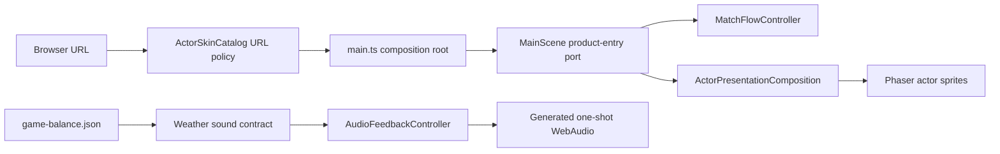
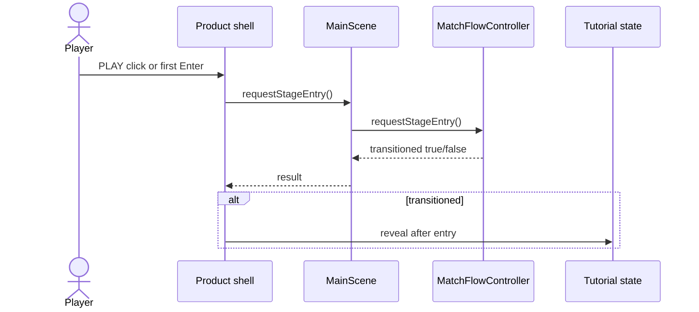

# Phase 11 Product Default Experience Architecture

- Date: 2026-08-20
- Decision: user-directed productization pivot, product-owner approved
- Scope: default actor selection, default weather-audio policy, first-entry presentation
- Non-goal: Phase 12 world-object art replacement or a claim of commercial completion

## Assumptions and constraints

- The first ten seconds on `/` must show the authored Quaternius BLUE/RED actors rather than the legacy vehicle presentation.
- Atlas validation remains fail-closed: any manifest, team, frame, transfer, GPU, or mipmap failure resolves both actors to Ground Shaker.
- The generated continuous weather oscillator is prototype audio and is not an acceptable default product experience. Short combat/UI SFX remain enabled.
- Collision, combat, balance, weather mechanics, progression, input semantics, persistence schema, generated atlas bytes, and asset tooling do not change.
- The existing `MainScene` and scene-lifetime actor composition remain the only owners of Phaser objects. The DOM owns only the product shell and entry intent.

## Layer and component map



Allowed dependency direction is Presentation (`main.ts`, `MainScene`) -> Business policy (`ActorSkinCatalog`, match-flow rules, weather sound contract). Static JSON is the data/config boundary. No domain module imports DOM, Phaser, WebAudio, or storage types.

## Boundary contracts

### Actor URL selection policy

`resolveActorSkinFromSearch(search)` owns browser-selection semantics:

- missing `actorSkin` -> `quaternius-animated`;
- explicit `quaternius-animated`, `legacy-vehicle`, or `kenney-infantry` -> the requested definition;
- unknown value -> legacy fail-safe.

`getActorSkinDefinition(null)` retains its legacy meaning so tests, fallback construction, and non-browser composition do not silently change. Runtime validation still owns the requested-to-effective transition and reports the effective skin to the DOM.

### Product entry port

```ts
interface ProductStageEntryPort {
  requestStageEntry(): boolean;
}
```

The call is synchronous, UI-thread-only, and idempotent. It returns `true` only when it transitions `stage-entry` to `team-select`; duplicate CTA/Enter delivery returns `false`. It does not select or confirm a team. `MainScene` owns the port for its scene lifetime and delegates to `MatchFlowController`.

### Default audio policy

The existing `GameBalanceWeather.soundChannels` map is the configuration boundary. An empty map means the product starts no continuous weather playback. Weather visual/mechanical state still changes normally. The weather-loop adapter and contract tests remain available for a future authored ambient asset, but production config emits no weather play item, keeps `activeWeatherLoopCue` null, and leaves no oscillator to dispose.

There is no persistence migration: master volume, SFX volume, and tutorial dismissal keep schema version 1.

## Entry sequence and lifetime



The DOM removes its CTA listener when the Phaser game is destroyed. `MainScene` continues to destroy actor overlays, animation listeners, and audio ownership before Phaser scene objects are released. There are no workers, retries, queues beyond the existing synchronous weather event queue, or network acquisition paths.

## Decisions and rejected alternatives

- Promote only browser default selection now; do not change the catalog's null fallback. This keeps fallback semantics explicit and testable.
- Disable continuous generated weather audio in config; do not merely lower a harsh oscillator or add an unreviewed external asset pipeline.
- Reuse the verified stage-entry transition through a named product port; do not synthesize keyboard events or call a debug-only API from the DOM.
- Keep the first pass to actor/audio/entry identity. Replacing all 11 object families without a target-frame review would mix art directions and invalidate the bounded slice.

## Ordered implementation and verification

1. Add the URL default-selection contract and unit matrix.
2. Empty production weather sound channels and prove five weather states enqueue no loop while combat SFX remain routed.
3. Add the idempotent product-entry port, branded CTA, and deferred tutorial reveal.
4. Update focused browser contracts for `/`, explicit legacy/Kenney/animated, unknown, and total fallback.
5. Rebuild the five-weather readability evidence on `/` and compare production performance against `?actorSkin=legacy-vehicle` without relaxing budgets.
6. Run current-fingerprint review and leave Phase 12 object art plus T5 finalization pending.

Acceptance requires a non-black 960x540 production capture, visible BLUE/RED animated actors on `/`, no prototype/POC/license wording in primary UI, zero continuous weather oscillator activity, one entry transition for click or Enter, and zero console/page/request/unhandled errors.
