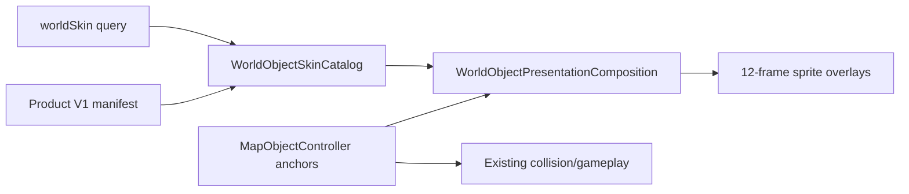
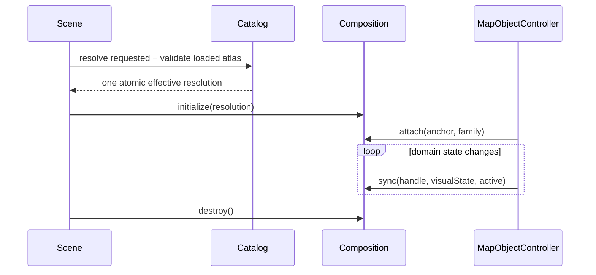
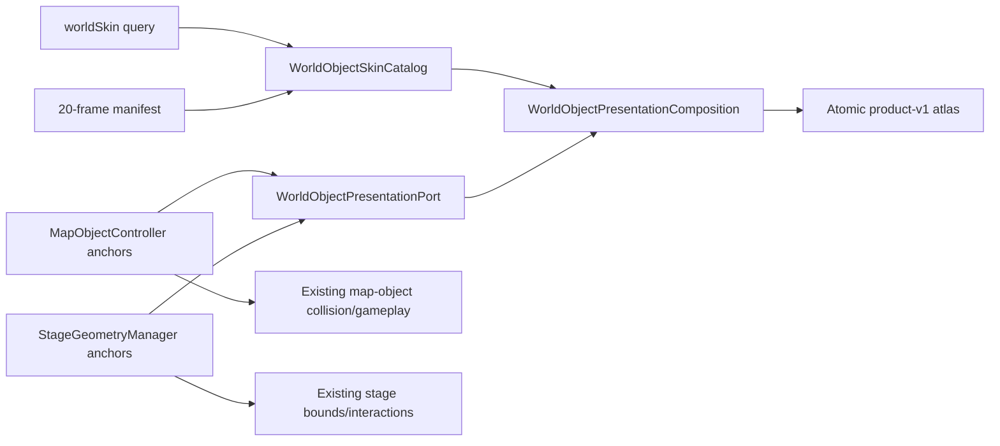
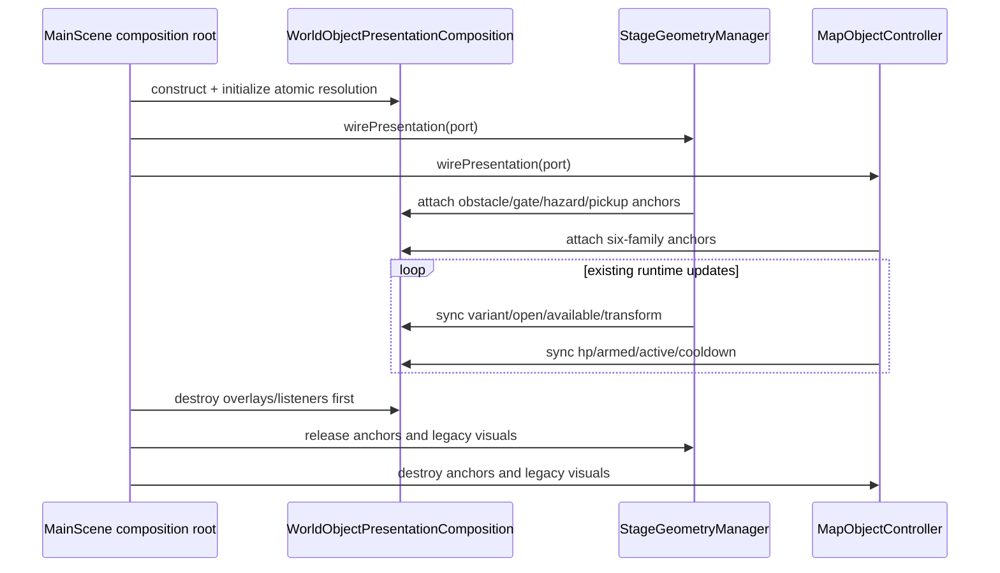

# Phase 12 Architecture - Product V1 Map-Object Vertical Slice

- Date: 2026-08-21
- Decision: product-owner architecture approved; user approved target frame v5 and authorized the six-family runtime slice
- Runtime entry gate: passed; Phase 11 complete and v5 explicitly approved by the user on 2026-08-21
- Runtime route: `?worldSkin=product-v1`; `/`, explicit `legacy`, and unknown values remain legacy world presentation
- Target frame: `../reports/phase12-t0-evidence/phase12-foundry-target-frame-v5.png` (approved visual contract)

## Assumptions and constraints

- The user-visible gap is the glyph-and-shape presentation of six `MapObjectController` families, not their gameplay behavior.
- Quaternius actors remain the character baseline. Existing colliders, damage, timing, AI, projectile behavior, persistence, audio policy, and actor atlas bytes are immutable inputs.
- The target style is top-down three-quarter low-poly art with steel/navy materials, orange hazard accents, one outline/shadow language, and readable actor-first contrast.
- The six runtime families and states are barrel `idle/damaged`, mine `idle/armed`, crate `idle/damaged`, cover `idle/damaged`, bounce wall `idle/active`, and teleporter `idle/active`.
- Gate, vent, pickups, and arena obstacle families may appear in the target frame as direction only; they are not part of this runtime slice.

## Three-layer boundary

| Layer | Responsibility | Planned modules |
| --- | --- | --- |
| Presentation | Load the opt-in atlas, create overlay sprites, map domain snapshots to visual states, keep anchors/colliders untouched, dispose scene objects | `WorldObjectPresentationComposition`, `MapObjectController` wiring |
| Business | Route resolution, exact 12-frame contract, family/state mapping, manifest validation, atomic effective-skin decision | `WorldObjectSkinCatalog` |
| Data/build | Immutable WebP/JSON/manifest, generation prompt/provenance, hashes, dimensions, transfer/GPU/mipmap facts | `public/assets/runtime/world/product-v1/` |

Allowed dependency direction is Presentation -> Business contracts <- immutable Data. Business imports neither Phaser nor DOM types. The composition root injects one validated skin decision into all six families; individual objects may not activate independently.

## Interface and manifest contracts

```ts
type WorldSkinId = "legacy" | "product-v1";
type WorldObjectFamily = "barrel" | "mine" | "crate" | "cover" | "bounce-wall" | "teleporter";
type ProductObjectState = "idle" | "damaged" | "armed" | "active";

interface WorldObjectSkinResolution {
  readonly requestedSkinId: WorldSkinId;
  readonly effectiveSkinId: WorldSkinId;
  readonly fallbackReason: string | null;
  readonly atlasActive: boolean;
}

interface WorldObjectPresentationPort {
  initialize(): void;
  attach(anchor: object, family: WorldObjectFamily): object | null;
  sync(handle: object, state: ProductObjectState, active: boolean): void;
  destroy(): void;
}
```

The concrete Phaser adapter narrows the opaque handles internally. `initialize()` and `destroy()` are idempotent. Anchors own position/collision truth; overlays are non-interactive scene-lifetime children.

Manifest schema `1.0.0` declares one `1024×1024` WebP, one Phaser JSON, exactly 12 namespaced frames, mipmaps false, transfer bytes, raw RGBA bytes, source prompt date, generator identifier, and SHA-256 hashes. Validation is synchronous over already-loaded immutable data. Any version, texture, JSON, frame, hash, dimension, transfer, GPU, or mipmap mismatch resolves the entire slice to legacy.

## Component and sequence views





## Lifetime and budgets

- Source prompt and target frame are repository-lifetime evidence. Atlas build staging is command-lifetime. Promoted atlas files are immutable build artifacts.
- One composition exists per scene. Overlay sprites are owned by it and destroyed before anchors and scene references are released.
- Atlas: at most `1024×1024`, `2 MiB` uncached transfer, `4 MiB` raw RGBA, mipmaps disabled. Combined product assets remain within `12 MiB` transfer and `64 MiB` raw GPU.
- Product-world p95 regression is at most `0.5 ms` versus legacy world with identical actor setup; missed-refresh count is zero. Absolute and cadence fields remain separate.

## Target-frame gate

The first deliverable is a 960×540 Foundry concept frame containing BLUE and RED Quaternius-scale operators, representative barrel, crate, hard cover, teleporter, pickup, and service gate. It must communicate function without glyphs or world text, preserve actor priority, and establish projection, scale, material, outline, shadow, hazard accent, and palette. No runtime atlas or code wiring may be promoted until the user approves this frame.

## Risks and rejected alternatives

- Generated sprites may drift in camera angle or scale. Lock one target frame first, then derive individual opaque cutouts from the same visual specification.
- Chroma-key removal can fringe around orange/blue materials. Validate alpha corners, subject coverage, despill, and runtime downscale before promotion.
- Rejected: replacing collision shapes, mixing unrelated existing packs, enabling only valid families after partial validation, or making Product V1 the default before the complete visual-pack phase.

## Ordered slices and acceptance

1. Complete Phase 11 cadence qualification and T5.
2. Generate and inspect the Foundry target frame; obtain user visual approval.
3. Generate the 12-frame atlas and provenance manifest within budgets.
4. Implement catalog validation and route matrix with pure unit tests.
5. Add the scene-lifetime overlay composition and state synchronization without changing anchors/bounds.
6. Verify atomic fallback, state transitions, duplicate initialize/destroy, exact positions/colliders, three stages by five weather captures, default/legacy/opt-in routes, zero runtime/audio errors, and p95 regression.

## T1 implementation result - 2026-08-21

- Generated twelve immutable alpha PNG sources from the approved v5 art direction and pinned their bytes and SHA-256 records in `tools/world-object-atlas/source-lock.json`.
- `npm run assets:world-object-atlas` now performs two isolated Sharp 0.35.3 builds, compares all release bytes, validates schema/order/alpha/dimensions/budgets, and atomically promotes or restores the complete release.
- The runtime release is one 1024x1024 lossless WebP plus Phaser JSON and manifest: 295,024 total bytes, 4,194,304 raw RGBA bytes, and mipmaps disabled. WebP SHA-256 is `c5598986a42ee5f6dffb992707f26dad8a3196d34b479c3055a754b2abbe86f6`; JSON SHA-256 is `713f8b621815cd48970748729b4f61dccd95788ce713a66d911722709b2dc18b`.
- `WorldObjectSkinCatalog` owns the route, exact twelve-frame matrix, layouts, state mapping, pinned manifest contract, and fail-closed atomic resolution without Phaser imports.
- `WorldObjectPresentationComposition` owns opt-in preload, overlays, sync, debug state, detach/clear/destroy, and scene reference release. `MapObjectController` retains all anchors, colliders, states, damage, interactions, and spawn positions.
- `/`, explicit `legacy`, and unknown values keep legacy world art. Only `?worldSkin=product-v1` requests and activates the new atlas. Any manifest, frame, texture, dimension, hash, or budget mismatch falls all six families back together.
- Verification produced fifteen 960x540 combat-state captures across three stages and five weather states with all six families covered, exact overlay/domain counts, non-black/contrast checks, and zero browser errors. The final AB-BA-AB production measurements report product p95 0.1ms and -0.4ms to -0.7ms regression versus legacy against the 0.5ms limit.
- This completes only the six-family T1 vertical slice. Arena obstacles, service gates, hazard/vent surfaces, ammo pickup, and health pickup remain Phase 12 follow-up work; product world art remains opt-in until the complete promotion gate.

## T2 architecture extension - 2026-08-24

### Assumptions and constraints

- T2 extends the same opt-in `product-v1` request and total-fallback decision to the five remaining product families: arena obstacle, service gate, vent/hazard surface, ammo pickup, and health pickup.
- The exact T2 frame matrix is arena obstacle `core/tower/barrier`, service gate `closed/open`, vent/hazard `active`, ammo pickup `available`, and health pickup `available`. Pickup collection/respawn clips, vent activation animation, and other one-shot motion remain Phase 13.
- Existing stage positions, display/collision bounds, gate interaction, hazard damage/timing, pickup amount/respawn, stage definitions, actors, audio, AI, and input are immutable inputs.
- The expanded single atlas is at most `2048x1024`, 4 MiB transfer, and 8 MiB raw RGBA with mipmaps disabled. The combined product pack remains at most 12 MiB transfer and 64 MiB raw GPU.
- Default, explicit legacy, and unknown routes stay legacy. Any T1 or T2 manifest, source, frame, texture, dimension, hash, transfer, GPU, or mipmap failure falls all eleven product families back together.

### Layer and component map

| Layer | T2 responsibility | Module |
| --- | --- | --- |
| Presentation | Keep Phaser anchors as transform/collision truth, attach authored overlays for both controller ownership trees, synchronize gate/pickup state, suppress legacy glyphs only while the atomic product skin is active, and detach before anchors are released | `WorldObjectPresentationComposition`, `MapObjectController`, `StageGeometryManager` |
| Business | Own the eleven-family product inventory, exact twenty-frame order, family/state mapping, layout policy, route selection, expanded manifest validation, and one atomic effective-skin result without Phaser imports | `WorldObjectSkinCatalog` |
| Data/build | Pin twenty immutable source PNGs and generate one byte-reproducible WebP/JSON/manifest release through validated staging and atomic promotion/rollback | `public/assets/source/product-v1-map-objects`, `tools/world-object-atlas`, `public/assets/runtime/world/product-v1` |

Allowed dependency direction remains Presentation -> Business contracts <- immutable Data/build output. `StageGeometryManager` and `MapObjectController` depend only on the presentation port; the composition never imports either controller.



### Interface and state contract

```ts
type ProductWorldObjectFamily =
  | "barrel" | "mine" | "crate" | "cover" | "bounce-wall" | "teleporter"
  | "arena-obstacle" | "service-gate" | "vent-hazard" | "ammo-pickup" | "health-pickup";

type ProductWorldObjectState =
  | "idle" | "damaged" | "armed" | "active"
  | "core" | "tower" | "barrier" | "closed" | "open" | "available";

interface WorldObjectPresentationAnchor {
  readonly x: number;
  readonly y: number;
  readonly rotation: number;
  readonly displayWidth: number;
  readonly displayHeight: number;
  readonly visible: boolean;
}

interface WorldObjectPresentationPort {
  readonly atlasActive: boolean;
  initialize(): void;
  attach(anchor: WorldObjectPresentationAnchor, family: ProductWorldObjectFamily, id: string): WorldObjectPresentationHandle | null;
  sync(handle: WorldObjectPresentationHandle, input: WorldObjectPresentationSyncInput): void;
  detach(handle: WorldObjectPresentationHandle | null): void;
  clear(): void;
  destroy(): void;
}
```

- `attach`, `detach`, `clear`, `initialize`, and `destroy` remain synchronous and idempotent. There is no worker thread, cancellation, retry, persistence schema, or network acquisition in this slice.
- Fixed-scale layouts continue to serve the six T1 families and two pickups. Anchor-size layouts mirror existing obstacle, gate, and hazard display bounds without becoming collision owners.
- The catalog maps obstacle shape to `core/tower/barrier`, gate boolean to `closed/open`, the hazard surface to `active`, and an available pickup to `available`. Unavailable pickups hide their overlays until the existing respawn transition makes the anchor available again.
- The production presentation hides labels, glyphs, and procedural decoration only after the complete twenty-frame runtime decision succeeds. Legacy and fallback behavior keep the existing objects unchanged.

### Ownership and lifecycle



- `MainScene` creates one scene-lifetime composition, wires both controller owners, and destroys the composition before either controller releases anchors.
- `StageGeometryManager` owns stage anchors, legacy decorative objects, and presentation handles for its branch. Stage rotation detaches obstacle handles before destroying/recreating obstacle anchors; scene release is idempotent.
- `MapObjectController` retains its existing ownership. Neither controller owns atlas resources or the effective-skin decision.

### Risks, alternatives, and verification slices

- Rejected: a second independently activated T2 atlas, because it permits partial six-family/five-family activation. One expanded manifest and resolution keep fallback atomic.
- Rejected: replacing Phaser anchors with authored sprites, because anchors are the verified position, interaction, and collision truth.
- Risk: an expanded atlas changes pinned T1 release hashes. Mitigation: retain all twelve T1 source hashes, validate all twenty ordered records, and require two byte-identical isolated builds before promotion.
- Risk: hiding procedural stage visuals can leave labels or listeners behind. Mitigation: track every legacy visual and presentation handle per owner, exercise stage rotation and scene restart, and assert zero orphan overlays.
- Ordered implementation: (1) extend generator/source lock and regenerate the atomic release; (2) extend the pure catalog and manifest contracts; (3) generalize the presentation anchor/layout port; (4) wire `StageGeometryManager` state and lifecycle; (5) run focused/static/full/browser gates. T3 cohesion/performance closeout remains pending.
