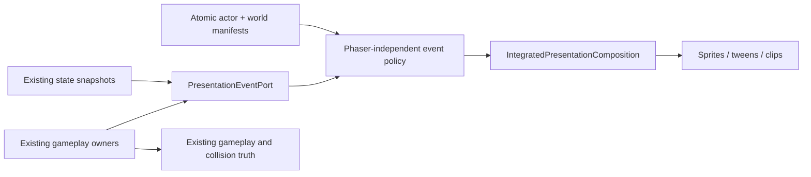
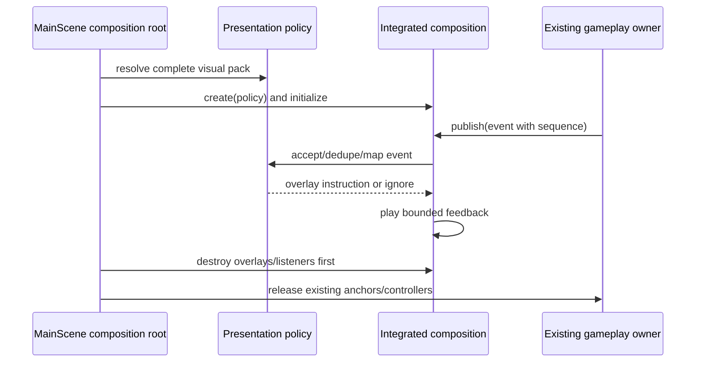

# Phase 13 Architecture — Integrated Presentation and Default Promotion

- Date: 2026-08-31
- Decision: product-owner architecture approved; runtime implementation and default promotion remain unapproved
- Approval evidence: `../reports/phase13-t0-evidence/product-owner-decision.md`
- Entry gate: Phase 12 complete with the 11-family `product-v1` pack kept opt-in
- Runtime routes: `/` keeps the current world-skin resolution until the separate promotion gate; `?worldSkin=product-v1` is the integration route; explicit legacy remains total fallback

## Constraints and scope

Phase 13 adds presentation-only responses for existing actor and map-object events. It must not alter damage, cooldowns, collider/bounds, spawn positions, AI, weapons, balance, maps, weather mechanics/audio policy, HUD, persistence, or asset licensing. The existing actor priority stays `death > hit > fire > run > idle`; fire uses aim direction and all other actor states use movement direction.

The product pack remains atomic: any malformed, missing, incomplete, or over-budget actor or world input selects the complete legacy pack. The final `/` promotion is a separate user approval after successful integrated evidence; it is not authorized by this document.

## Three-layer boundary

| Layer | Responsibility | Planned modules |
| --- | --- | --- |
| Presentation | Convert immutable intents into non-authoritative overlay clips/tweens; own scene-lifetime cleanup and diagnostics | `IntegratedPresentationComposition`, Phaser adapter, existing actor/world composition wiring |
| Business | Define event/snapshot contracts, sequence idempotency, clip policy, pack resolution, and budget validation without Phaser types | `PresentationEvent`, `PresentationEventPort`, actor/world visual catalogs |
| Data/build | Supply immutable validated actor/world manifests and retain evidence/report artifacts | `public/assets/runtime/**`, existing manifest validators, `docs/reports/phase13-*-evidence/` |

Dependencies flow Presentation -> Business contracts <- Data/build. Gameplay owners may publish Business-layer intents but Presentation never mutates gameplay state or imports controller internals.

## Interface contract

```ts
type PresentationFamily =
  | "actor" | "barrel" | "mine" | "crate" | "cover" | "bounce-wall"
  | "teleporter" | "service-gate" | "vent-hazard" | "ammo-pickup" | "health-pickup";

type PresentationEventKind =
  | "damage" | "destroy" | "arm" | "reflect" | "teleport"
  | "trigger" | "gate-open" | "gate-close" | "hazard-pulse" | "collect" | "respawn";

interface PresentationEvent {
  readonly subjectId: string;
  readonly family: PresentationFamily;
  readonly event: PresentationEventKind;
  readonly occurredAt: number;
  readonly state: string;
  readonly sequence: number;
  readonly movementDirection: number | null;
  readonly aimDirection: number | null;
}

interface PresentationEventPort {
  publish(event: PresentationEvent): void;
  syncSnapshot(subjectId: string, state: string, sequence: number): void;
  destroy(): void;
}
```

`PresentationEventKind` includes `trigger` for a mine detonation response. `sequence` is strictly monotonic per `subjectId`; duplicate or stale events are ignored, while a newer snapshot defines the base frame. Actor policy reads `aimDirection` only for `fire` and `movementDirection` for `idle`, `run`, `hit`, and `death`; object consumers ignore both. One-shot feedback can be coalesced but never restarts from duplicate delivery and never changes domain timers. Calls are synchronous on the Phaser scene thread: there is no worker, network, persistence, retry, cancellation, or schema migration in this phase. `destroy()` is idempotent.

## Components and lifetime





One integrated composition is owned by `MainScene`. It releases its tweens, listeners, and overlays before `StageGeometryManager`, `MapObjectController`, or actor anchors are destroyed. A stage transition or scene restart must leave no controllers, animation keys, or callbacks live.

## Required response policy

| Family | Required feedback |
| --- | --- |
| barrel, crate, cover | damage pulse and destruction response |
| mine | arm and trigger response |
| bounce wall | reflection flash |
| teleporter | transfer pulse |
| service gate | open/close transition |
| vent/hazard | activation cadence |
| ammo/health pickup | collect and respawn transition |
| arena obstacle variants | static only |

## Migration and verification gates

1. Implement and prove event integration only on `?worldSkin=product-v1`; the absent world-skin route remains unchanged.
2. Run pure event order/deduplication/fallback tests, focused interaction Playwright coverage, full type/lint/unit/build/browser gates, and Phase 13-only artifacts: 15 fixed 960x540 screenshots (3 stages x 5 weather) plus triggered-response frames, hashes, contrast checks, zero console/page/request errors, restart cleanup, and legacy/product collider parity.
3. Validate the complete product pack at no more than 12 MiB transfer and 64 MiB estimated raw RGBA GPU memory. Run same-scenario D3D11 AB-BA-AB measurements against total legacy and total product routes. Retain Phase 11 cadence/absolute facts and Phase 12 reports unchanged; require no new sample above 16.7 ms and integrated p95 regression <= 1.0 ms.
4. Obtain current-fingerprint reviewer pass, manual-drift, and postflight evidence. Produce a named default-promotion capture packet.
5. Obtain explicit user approval. Only then change absent `worldSkin` resolution to `product-v1`, retain explicit legacy and unknown fail-closed routes, and rerun the final default/legacy evidence.

## Rejected alternatives and risks

- Rejected: animation controllers that own gameplay timing or collision; verified gameplay owners remain authoritative.
- Rejected: per-family partial promotion; it violates atomic fallback.
- Rejected: treating prior Phase 11/12 reports as Phase 13 proof; all new reports use isolated Phase 13 paths.

Main risks are duplicate event delivery, stale callbacks after restart, weather readability loss, bundle/GPU growth, and accidental default promotion. Sequence deduplication, bounded scene-lifetime ownership, the fixed screenshot matrix, manifest validation, strict budgets, and the separate user gate mitigate them.
