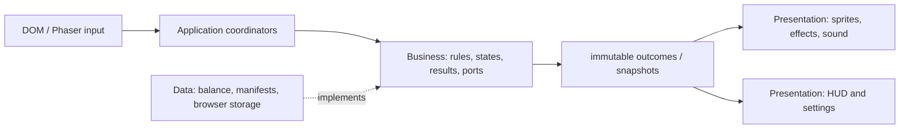
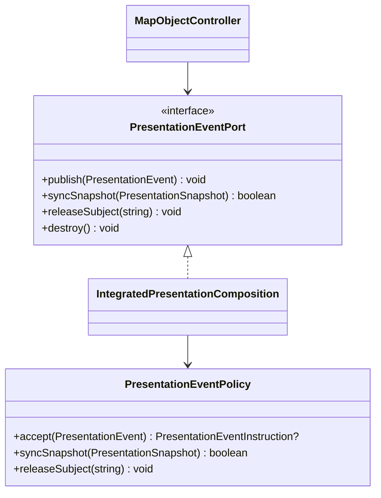
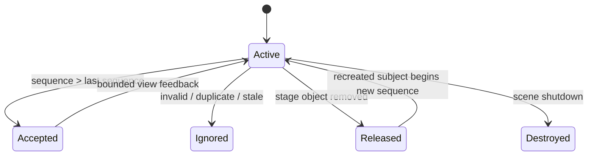

# Phase 13 Layered Refactor Architecture

## Purpose and constraints

- Product-owner decision: approved 2026-09-01; evidence:
  `../reports/phase13-t1-evidence/product-owner-decision.md`.

This refactor makes the active Phaser game explicitly layered without changing
gameplay authority, collider geometry, balance, routes, or the separately
user-gated default world-skin promotion. Phaser callbacks remain synchronous on
the scene thread. A view may react to a business outcome, but it must never
change the outcome.

Allowed dependencies are `Presentation -> Business <- Data`. `main.ts` and
`MainScene` are composition roots: they may construct adapters, but domain code
must not import Phaser, `window`, local storage, asset-loader types, or a
concrete adapter.

## Responsibilities and contracts

| Family | Business owner | Presentation owner | Data owner |
| --- | --- | --- | --- |
| Hit | collision/damage result, health delta, gauge ratio, event sequence | sprite flash, fragment/VFX, camera, damage number | balance inputs |
| Character | motion/aim/death state and animation intent | actor atlas, body/weapon sprite and effect | actor manifest |
| Background | weather, wind and area-effect state | terrain, weather particles, shadows | stage/weather definitions |
| Item | eligibility, applied amount, expiry | pickup image/timer feedback | pickup balance |
| Weapon | fire/reload/switch/ammo result | projectile, weapon image/motion | weapon balance/assets |
| Audio | semantic cue and priority decision | WebAudio/Phaser playback | cue profile/configuration |
| HUD | immutable `HudSnapshot` fields | DOM renderers | persisted settings/progression |

Business functions return immutable typed results and do one thing. Stable
substitution uses ports; optional behaviour uses composition, not inheritance.
`PresentationEventPort` is the scene-thread boundary for non-authoritative
responses. Its policy owns per-subject sequence deduplication; `releaseSubject`
prevents an old stage instance from rejecting a recreated object with the same
ID.

## Lifetime and race rules

`MainScene` owns scene-scoped controllers. Shutdown releases integrated effects
and tweens first, then actor/world anchors, geometry and map controllers. Every
`destroy` is idempotent. Tween completion is guarded by membership in the live
effect set. There are no workers, I/O retries, or persistent writes on the
event path; if one is introduced later it must use cancellation plus a
generation/sequence guard before updating a view.

## Migration slices and gates

1. Establish the layer contract and extend the pure presentation-event policy
   for all requested families, snapshots, and restart-safe release.
2. Migrate map-object transitions to event publication without changing map
   collision or damage authority; then add actor combat, pickup, weapon,
   weather/audio, and HUD ports one vertical slice at a time.
3. Keep `CombatResolution`, `PlayerLogic`, `PickupLogic`, `WeaponLogic`,
   `WeatherLogic`, and HUD presenters independently testable. Extract adapters
   only behind ports and retain the existing scene update ordering.
4. Require focused contracts after each slice; after the final edit run type
   check, lint, unit tests, build, relevant browser tests, reviewer, drift, and
   postflight.

Rejected: a global event singleton, gameplay mutation from a view, async
fire-and-forget effects, partial product-pack activation, and a broad
`MainScene` rewrite. These would hide ownership or risk deterministic update
ordering.
