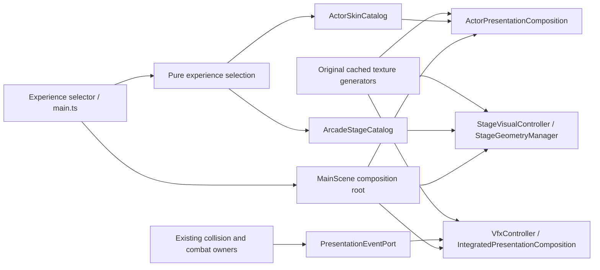

# Toy Arcade Experience

Date: 2026-09-08. Explicit user request authorizes original cute character skins,
maze/seaside/casual stages, projectile skins, collision feedback, and parallel
implementation. Product-owner decision: approved, recorded by the project
`product_owner` agent before implementation.

## Product direction

Create a bright, classic toy arcade for the requested audience of women in their
teens and twenties. Expressive bunny/bear hoods, readable faces, compact bodies,
coordinated mint/peach/cream colors, rounded shaded blocks, and glossy bubble/star
effects are design hypotheses; no demographic preference or commercial-quality
claim is established without user feedback. Crazy Arcade is a readability and
genre reference; all new artwork and layouts are original.

The product owner accepted a discoverable named experience in a follow-up decision:
the ordinary `/` entry includes a prominent Cozy Arcade selection panel and
`?arcade=cozy` opens the new skins and three stages. The panel chooses a character
and first stage before play. Existing routes keep their historical gameplay
configuration. This is a new experience, not promotion of Phase 13's
`product-v1` pack. No weapon statistics or progression rules change.

## Architecture and contracts

Presentation owns Phaser objects and UI, Business owns typed selection, stages,
skins, and immutable presentation events, and Data/build supplies existing
validated assets and original deterministic texture inputs. Domain code has no
Phaser dependencies. No database, network, worker, or storage migration is needed.

- Actors: `arcade-bunny` and `arcade-bear`, BLUE/RED variants, five animation
  states, directional presentation, independently aimed external water blaster.
  Hidden legacy anchors retain authoritative actor bounds.
- Stages: `ARCADE_STAGES: readonly StageDefinitionWithContent[]` and
  `getArcadeStagesStartingWith(id: string | null)` expose `garden-maze`,
  `bubble-bay`, `picnic-plaza`. Unknown selection uses the first stage.
- Effects: existing `PresentationEventPort` carries authoritative object events;
  an optional arcade presentation flag selects cosmetic fragments. VFX and
  projectile decoration never change damage or collision extents.
- Selection: unrecognized input uses a known preset; changing a selection reloads
  the scene through an ordinary URL, preserving a reproducible entry route.

Everything runs synchronously on the scene thread. Cache textures once per game;
own overlay sprites, tweens, and listeners for the scene lifetime. On shutdown,
stop cosmetic producers, destroy their effects, then release actor/world anchors.
Cleanup is idempotent. Bounded effects drop the oldest cosmetic entries under load.

## Parallel ownership

The user's explicit parallel request supersedes the delivery manual's main-only
implementation guideline. The main thread remains accountable for integration,
deterministic verification, independent review, and reporting.

| Owner | Files and responsibility |
| --- | --- |
| Actor implementer | Actor catalog, actor composition/controller, new actor art, focused actor tests |
| Stage implementer | New stage catalog/art, stage visual controller, stage geometry rendering, focused stage tests |
| Main thread | Shared configuration and scene integration, selector UI, VFX/projectile integration, browser checks |
| Read-only reviewer | Final diff, acceptance evidence, regressions, and limitations |

## Acceptance and verification

1. Ordinary entry exposes Cozy Arcade. Its play route shows new art; two skins
   and three stages are selectable and remain correct after scene restarts.
2. Character expression, team identification, independent aim, five states, and
   collider parity are observable in the browser.
3. Stages have distinct traversal and valid reachable spawns/pickups. Decorative
   water must not imply collision that is absent from the authoritative layout.
4. Ordinary shots and at least two special categories look distinct. Real object
   damage/destruction emits bounded fragments which expire and clear on restart.
5. Capture each stage, both skins, representative effects, and five weather modes;
   inspect readability and console/network errors. Do not infer visual acceptance
   or historic 16.7ms performance qualification from static tests.
6. Run focused tests, type-check, lint, all unit tests, production build, and full
   Playwright regression. Preserve historical default-route assertions; new tests
   cover visible entry into the new experience and its direct route.
7. Keep MainScene within 850 lines without compressing unrelated code. Preserve
   existing dirty reports and root coordination artifacts.
8. Obtain independent reviewer pass, manual drift, and scoped postflight evidence;
   report any unavailable gate honestly.

Required manuals: `handoff-execution`, `game-verification`, `reliability-gate`.
OpenViking execution is separate: the user subsequently authorized installation.
OpenViking 0.4.19 is installed in an isolated Python 3.12 environment and the
official openviking-memory 0.8.1 Codex plugin is installed and enabled from the
upstream v0.4.19 marketplace ref. The client points to loopback port 1933 only.
Server model configuration and fresh-session hook trust remain pending user
choice; no paid provider, API key, project ingestion, or hook trust was assumed.
