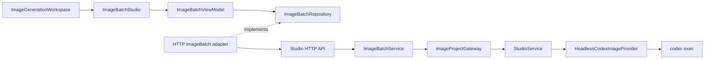
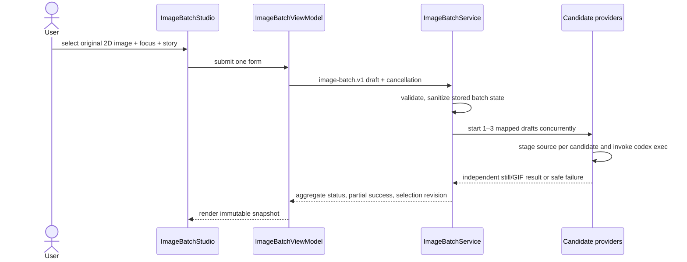

# Reference-guided unified image batch UX

## Decision

Use one `image-batch.v1` form and one batch request for every `/real` submission. The batch creates one to three independently tracked candidates; each candidate owns one trusted-local Codex image-generation call. In 2D-to-photo mode, the same attested original raster is the sole visual attachment for those candidate calls. The user selects which allowed visual domains to preserve, while the story remains authoritative for action, emotion, event, and intentional scene change. The system does not claim automatic image recognition, identity matching, OCR, pixel copying, or a provider-native similarity score.

## Constraints and failure model

- The browser sends one original PNG/JPEG/WebP under 6 MB only for 2D-to-photo mode. Invalid and oversized selections are rejected, removed from the native file input, and never become submittable state.
- The batch service passes the ephemeral source to each requested candidate. Each provider invocation stages it in a disposable workspace and sends it once with `codex exec --image`; text-to-photo candidates never attach an image.
- Source bytes, filenames, disposable paths, and raw provider diagnostics are excluded from batch snapshots and responses.
- Safety, original-content, fictional-adult, and non-identifying constraints override every other direction.
- A provider model may still interpret visual continuity imperfectly. The product communicates a requested preservation plan, not a similarity guarantee.
- The server-owned forecast starts at 5% after provider launch, divides ETA into 100 equal time slices, advances by 1% per completed slice, waits at 90%, and reaches 100% only for a validated terminal artifact.

## Layer and component contract



- `ImageBatchStudio` renders the one-form workflow; `ImageBatchViewModel` owns editable state, policy feedback, polling, cancellation, and stale file-read rejection.
- The business `ImageBatchRepository` contract isolates Presentation from HTTP. The composition root supplies the concrete adapter.
- `ImageBatchService` validates the batch, starts candidates concurrently through `imageProjectGateway`, aggregates partial results, and owns selection revisions.
- `StudioService` validates each candidate draft and composes the immutable request brief. It owns story/reference precedence and never exposes source bytes in project state.
- `HeadlessCodexImageProvider` owns staging, the single Codex command, returned-raster validation, GIF encoding, and workspace deletion.

The optional `sourceInput.referenceFocus` field is valid only for an attested 2D source:

```text
preserveSubjectVisuals: boolean
preserveBackgroundLayout: boolean
preserveCameraComposition: boolean
```

The field is authoring intent, not extracted source metadata, and is omitted from text-only batches. `outputPlan` accepts `still` with one frame or `motion_gif` with 2–30 frames; omitted legacy `image-batch.v1` output fields default to a one-frame still.

## Prompt precedence and data flow



Prompt ordering is fixed:

1. hard safety, rights, adult-only, and no-likeness constraints;
2. structured conditions plus the user story's subject, action, emotion, event, and intended change;
3. only the selected non-conflicting reference domains: fictional silhouette/clothing palette, background layout/lighting, and camera framing/perspective;
4. photorealistic rendering constraints.

## UI contract

`/real` is a four-stage Korean authoring flow mounted as `ImageGenerationWorkspace -> ImageBatchStudio`. The rail is informational; all controls remain in one form with one submit path.

1. **Input mode and reference.** Choose text-to-photo or 2D-to-photo. In 2D mode, attach one rights-held original and select at least one preservation focus.
2. **Unified settings.** Set subject, age/presentation/count where applicable, ethnicity/casting direction, country/cultural context, era, weather, environment, camera, framing, light, mood, perspective, wardrobe, and profession once. Human-only fields disappear for animals and birds. Human defaults are East Asian and South Korea; fictional K-Pop idol, fashion-model, and announcer archetypes remain independent of those selections.
3. **Story and output.** Edit one story, choose still or GIF/frame count, choose 1–3 candidates, attest rights, and submit once.
4. **Candidate result and selection.** Track candidates independently, preserve partial success, and select or reselect only completed candidates with an idempotent revisioned command.

Accessibility requirements:

- focus chips are native buttons with `aria-pressed`; their group is a `fieldset` with a `legend`;
- the source egress notice remains connected to the rights checkbox through `aria-describedby`;
- candidate lifecycle updates use an `aria-live="polite"` result region and accessible per-candidate progressbars;
- purely decorative activity and finalization indicators are hidden from assistive technology, and animation follows the existing reduced-motion rule.

## Progress and completion contract

The redesign preserves the server-owned progress model. It does not represent a provider model-render percentage and does not fabricate a provider ETA.

- After the provider actually starts, elapsed-time forecasts use `5 + floor(elapsed / (estimate / 100))`, remain monotonic, and are capped at 90%. Before provider start, the numeric forecast remains 0%.
- At 90%, the progress bar holds while the completion-wait panel names the real server state: waiting for provider output, validating the image, encoding GIF frames, or saving the artifact.
- Only a validated terminal artifact transitions to 100%. A failed or over-estimate job remains below 100% and renders the provider failure.
- Active candidate values are labeled `예상 진행률`. If polling fails, the last snapshot is relabeled `마지막 확인` and a result-adjacent connection notice distinguishes automatic retry from live progress.
- Three consecutive polling failures transition the presentation state to `disconnected` without stopping retries. Because batch state is memory-only, the notice explains that an API restart may make the old batch unrecoverable and offers a new-generation reset that preserves form settings.

## Verification and manual quality gate

Deterministic tests verify the single form and single request, invalid/oversized native file clearing, stale/out-of-order file reads, focus handling, text-mode reference removal, still/GIF bounds, legacy still defaults, mapping across all candidates, concurrent launch, source-byte non-retention, partial success, revisioned selection, server progress truth, and responsive no-overflow behavior.

Live visual fidelity cannot be proved by those contract tests. On a trusted local machine, an operator must use one rights-held, non-identifying 2D fixture with two materially different stories and inspect both outputs:

- selected silhouette/clothing, background layout, and camera framing remain recognizable only where selected;
- the two stories produce their requested action, emotion, event, and intentional scene change;
- no real-person likeness, logo, readable text, watermark, or unowned character is present.

This is a manual quality gate because the provider has no deterministic similarity score or model-render telemetry available to the local application.
