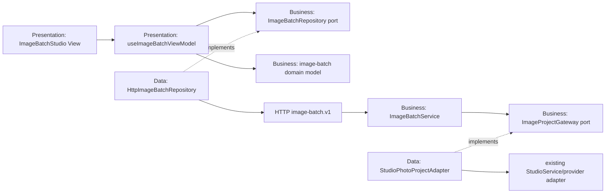
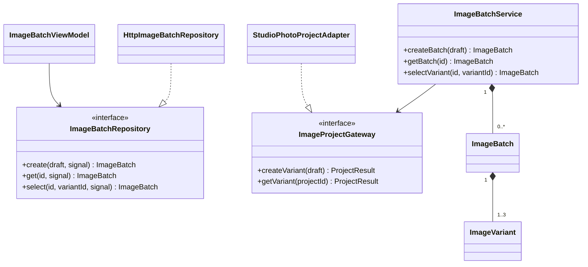
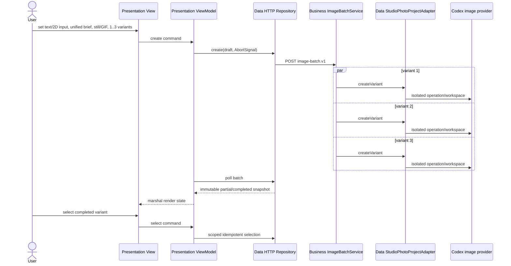

# TDD — Image batch architecture

## Constraints and quality attributes

IMG-001, IMG-002, and IMG-003 require deterministic server validation before infrastructure calls. IMG-004 and IMG-005 require bounded concurrency, isolated variant ownership, and partial success. IMG-006 requires scoped, idempotent mutation. IMG-007 defines layers. IMG-008 requires replaceable deterministic tests and safe operational state. IMG-009 has a schema-first U8 architecture but stays behind external-evidence and implementation gates. IMG-010 requires a deeply immutable Business default profile with fresh mutable copies at each ViewModel lifetime.

## Three-layer module map

Dependencies point inward: `Presentation -> Business <- Data`. The server composition root creates the existing provider service, Data adapter, and Business batch service. The browser composition root creates the HTTP repository and injects it into the ViewModel/View.

## Interfaces and classes

The JavaScript ports are structural contracts documented and exercised by contract tests; TypeScript owns the browser port types.

## Communication sequence

## DI and lifetime

| Object | Owner | lifetime | Disposal |
| --- | --- | --- | --- |
| `StudioService` | server composition root | application | stop accepting HTTP, await provider work, release process resources |
| `StudioPhotoProjectAdapter` | server composition root | application | non-owning reference to StudioService |
| `ImageBatchService` | server composition root | application | in-memory batches expire with process; clear after provider shutdown |
| Batch | ImageBatchService | API session | sanitized metadata only |
| Variant operation | existing StudioService | task | one fresh provider workspace per attempt; at most two attempts only for missing output; cleanup after every attempt |
| `HttpImageBatchRepository` | browser composition root | page | stateless; abort in-flight requests on ViewModel disposal |
| ViewModel polling timer | ViewModel | active batch | clear on terminal state or unmount |
| 2D reference state | ViewModel | mounted `/real` page | clear on text-mode switch or unmount; bytes are never copied into batch snapshots |
| `DEFAULT_IMAGE_BATCH_SETTINGS` | Business module | application/module | deeply frozen; copied into each ViewModel and never mutated by Presentation |

The batch fan-out uses `Promise.all` over at most three create operations. No batch lock is held across provider work or callbacks. Selection is synchronous against one in-memory batch record. Retry remains owned by the existing provider operation; batch orchestration does not duplicate retries. Only `provider_output_missing` receives one transparent retry in a fresh workspace. Provider timeouts and all other failure codes remain terminal for that variant.

## Domain and data decisions

- IMG-001 through IMG-003 use allow-lists plus `classifyImageDirection`; Business owns ethnicity/country compatibility defaults and human/nonhuman invariants, while the compact Studio-port prompt mapping carries those creator-selected values without media inference. Business requires an explicit fictional/non-identifying attestation for human text, enforces `fictional_adult` ↔ adult-20+-age and `no_person` ↔ `not_applicable`/person-free-text invariants, and distinguishes allowed non-graphic adult intent from minor/ambiguous, real-person, explicit/coercive, and erotic age-coded blocks before DTOs reach Data.
- IMG-004 creates distinct client request IDs and variation instructions. Each provider workspace remains independent.
- IMG-005 derives batch status at read time, preserving successful delivery DTOs.
- IMG-006 stores `{variantId, revision, selectedAt}` only after same-batch completion validation.
- IMG-007 keeps browser fetch and server provider types outside domain APIs.
- Presentation renders one passive form. `ImageBatchViewModel` owns the unified mode, ephemeral reference/focus, structured brief, output plan, count, consent, polling, and selection state; the HTTP repository remains the only browser Data implementation.
- IMG-008 exposes only bounded safe errors and current progress; raw source and paths never enter batch/audit state. The public story limit is 400 characters, compact mapping is runtime-guarded at the Studio port's 700-character detail-prompt limit, and a real domain-to-adapter test covers all three maximum-length treatments.
- IMG-009 U8 defines `RetouchSession`, `RetouchMask`, `EditRevision`, `ConsentRecord`, `SafetyDecision`, `ProvenanceEvent`, and `ExportDisclosure` as conceptual `retouch-protocol.v1` contracts. No runtime type, route, UI, provider or store implements them yet.
- IMG-010 keeps initial and subject-dependent values in Business. `createDefaultImageBatchFormSettings` returns fresh nested objects; human defaults include East Asian/South Korea, nonhuman defaults use `not_applicable`, and `applySubjectKindDefaults` changes only subject-dependent fields while preserving scene, story, and output state. Profession changes do not mutate ethnicity or country.

## Rejected alternatives and risks

- Extending the existing monolithic `StudioService` directly was rejected because it would deepen UI/provider coupling.
- A global queue was rejected for this local bounded slice; a production queue needs persistence, cancellation, quotas, backpressure, and recovery.
- Pixel retouch in Sprint 1 remains rejected. U8 now supplies the missing schema and migration design, but unresolved consent, rights, retention, provider and release evidence still blocks U9–U12 implementation.
- Free-text ethnicity, country, and archetype fields were rejected because bounded enums prevent names and preserve deterministic validation. Auto-changing ethnicity/country from a K-Pop selection was rejected because those creator choices are independent and must not encode a stereotype.
- Process-local batches disappear on restart; this is explicit for the trusted-local experiment.
# IMG-011 extension

선택 결과에서 개인 프로젝트로 이어지는 추가 계층·시퀀스·상태 계약은 [18-image-project-continuation-architecture.md](./18-image-project-continuation-architecture.md)를 단일 상세 설계로 사용한다. 기존 `image-batch.v1` API와 selection revision은 변경하지 않는다.

# IMG-009 extension

가역 리터치의 스키마, persistence 제약, 세 계층 port, 상태·sequence UML, cancellation/idempotency, 위협 분석, migration/rollback과 활성화 gate는 [19-retouch-protocol-architecture.md](./19-retouch-protocol-architecture.md)를 단일 상세 설계로 사용한다. U8은 문서 설계만 완료했으며 현재 composition root와 런타임에는 연결하지 않는다.
