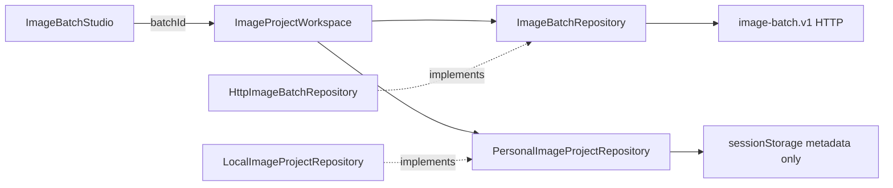
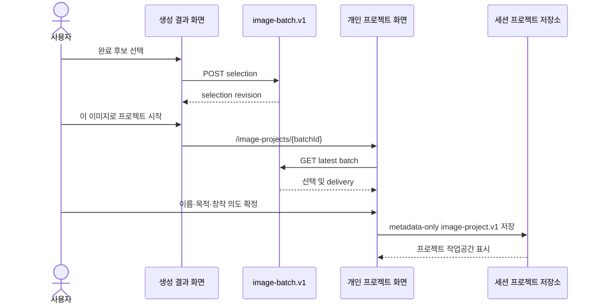

# IMG-011 — 선택 이미지의 개인 프로젝트 전환

## 제품 계약

완료된 이미지 배치 후보 하나를 서버에서 선택 확정한 사용자만 다음 단계로 이동한다. `/image-projects/{batchId}`는 최신 배치를 다시 조회하고 선택된 결과를 프로젝트의 기준 이미지로 사용한다. 사용자는 프로젝트 이름, 사용 목적, 창작 의도를 확정한 뒤 개인 프로젝트 작업공간을 연다.

이 기능은 trusted-local 세션의 개인 작업 흐름이다. 이미지 바이트는 프로젝트 메타데이터 저장소에 복사하지 않으며, 로그인·공유·서버 재시작 복구·My Studio 목록은 범위 밖이다.

## 계층과 계약

- Presentation은 후보 선택 성공 전에는 프로젝트 CTA를 표시하지 않는다.
- Business는 프로젝트 메타데이터 스키마, 길이 제한, 목적 allow-list, 선택 결과 해석을 소유한다.
- Data는 기존 HTTP 배치 조회와 브라우저 세션 메타데이터 저장을 구현한다.
- 프로젝트 저장 데이터는 `batchId`, `variantId`, 선택 revision, 제목, 목적, 창작 의도, 시각만 포함한다. 이미지 data URI와 업로드 원본은 저장하지 않는다.

## 시퀀스

## 상태와 실패 처리

- selection 없음, 완료되지 않은 후보, delivery 없음은 정상 프로젝트로 표시하지 않는다.
- 저장 직전에 최신 batch를 다시 조회한다. variant ID 또는 selection revision이 바뀌면 저장을 중단하고 최신 이미지를 표시한 뒤 사용자에게 재확정을 요구한다.
- 배치 404 또는 API 재시작은 복구됐다고 표현하지 않고 새 이미지 생성 동작을 제공한다.
- 저장된 메타데이터의 `variantId` 또는 selection revision이 최신 배치와 다르면 이전 프로젝트를 자동 적용하지 않고 다시 확정한다.
- 선택 중복 실행은 기존 ViewModel의 `selectingVariantId`로 차단한다.
- 프로세스 수명보다 긴 영속성, 계정 소유권, 리터치, 다운로드, 공유는 후속 설계 대상으로 남긴다.

## 검증 추적

- Business: 선택 후보 해석, 프로젝트 기본값, 필드 경계와 목적 allow-list.
- Data: 이미지 바이트를 저장하지 않는 metadata-only 직렬화.
- E2E: 3개 생성 → 완료 후보 선택 → CTA → 프로젝트 구체화 → 전체 normalized brief/output 표시, 저장 시 selection 경쟁 조건, 직접 URL 실패, 모바일 무오버플로.
- 회귀: 기존 delivery/ViewModel, API, build, 전체 Playwright.
