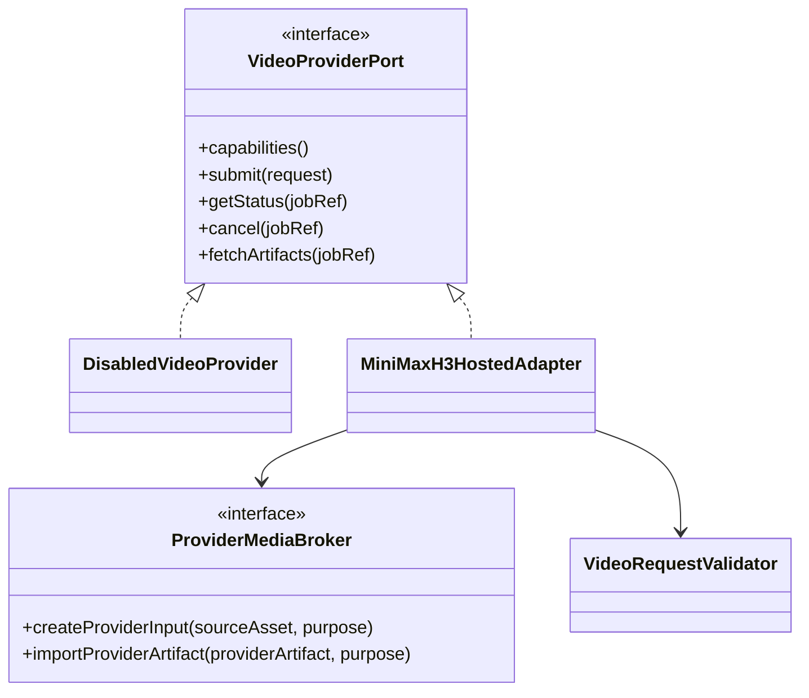
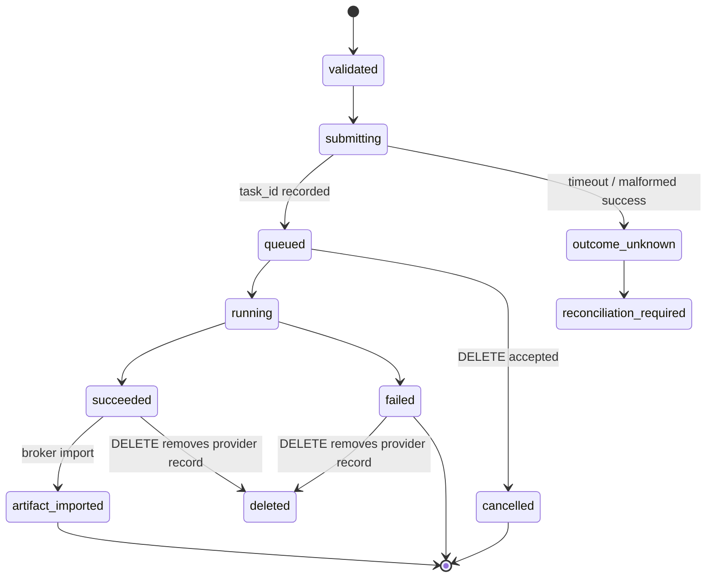

# ARS-006B — `video-provider.v1` architecture

Status: approved contract slice; production provider activation and media transfer remain deferred, 2026-08-24.

## Decision and boundary

The next video slice establishes a provider-neutral Business contract and a MiniMax H3 hosted-API Data adapter without activating video generation. The production composition root continues to return `DisabledVideoProvider`; there is no HTTP route, UI, API-key environment variable, global `fetch`, user-media upload, provider download, MP4 persistence, or billing action.

This boundary deliberately separates two MiniMax H3 distribution paths:

- Open weights: the H3 Community License excludes the Republic of Korea unless MiniMax grants a formal license.
- Hosted API: MiniMax documents global availability and the `MiniMax-H3` `/v2` API. Product integration is still deferred until commercial, retention/deletion, processing-region, account-owner, budget, and safety evidence is approved.

## Three-layer responsibilities

| Layer | Component | Responsibility | Must not do |
| --- | --- | --- | --- |
| Presentation | future private video API/ViewModel | submit an approved internal asset reference and render sanitized job state | receive provider tokens, signed input URLs, or provider output URLs |
| Business | `VideoProviderPort`, `video-provider.v1` validation | validate internal asset metadata, normalize status, enforce no automatic create retry and lifecycle rules | know MiniMax request JSON or issue network calls |
| Data | `MiniMaxH3HostedAdapter`, `ProviderMediaBroker` | materialize short-lived provider input URLs, map H3 `/v2`, import completed output into a private internal asset | expose credentials or provider URLs above the Data boundary |



## Business contracts

`VideoGenerationRequest` contains no bytes or URL:

```json
{
  "protocolVersion": "video-provider.v1",
  "mode": "image_to_video",
  "clientRequestId": "video-request-0001",
  "prompt": "Original scene and motion direction",
  "rightsAccepted": true,
  "sourceAsset": {
    "assetId": "asset-selected-0001",
    "sha256": "64 lowercase hexadecimal characters",
    "mimeType": "image/png",
    "width": 1080,
    "height": 1920
  },
  "output": {
    "durationSeconds": 8,
    "resolution": "768P",
    "ratio": "adaptive"
  }
}
```

The implemented first slice accepts one internal first-frame image, duration 4–15 seconds, `768P|2K`, and `adaptive`. The provider-neutral job reference is `{ providerId, taskId }`. A completed status exposes only `artifactAvailable`; `fetchArtifacts` must return private internal asset metadata from `ProviderMediaBroker`, never MiniMax's CDN URL.

`VideoProviderPort` methods return result objects rather than throwing expected provider failures. Stable error codes are the external contract:

| Condition | Code | Retry rule |
| --- | --- | --- |
| disabled composition | `video_provider_disabled` | no |
| missing credential/transport/broker | `video_provider_not_configured` | no |
| invalid request or job ref | `video_request_invalid` / `video_job_ref_invalid` | fix input |
| broker refuses input/import | `video_media_unavailable` / `video_artifact_import_failed` | no automatic retry |
| POST transport timeout or malformed 2xx | `video_submit_outcome_unknown` | never auto-resubmit; reconcile manually |
| provider 400/401/402/422/429/500 | stable `video_provider_*` code | create is never auto-retried |
| poll/cancel transport failure | `video_provider_transport_failed` | caller may retry reads; cancellation requires reconciliation |
| unknown provider payload/status | `video_provider_protocol_error` | fail closed |

## MiniMax H3 `/v2` mapping

- Create: `POST https://api.minimax.io/v2/video_generation`, model `MiniMax-H3`.
- I2V content: one text item and one `image_url` item with `role=first_frame`; the Data-only URL comes from `ProviderMediaBroker`.
- Query: `GET /v2/query/video_generation/{task_id}`.
- Cancel/delete: `DELETE /v2/video_generation/{task_id}`. MiniMax cancels only `queued`; `running` cannot be cancelled, while succeeded/failed task records are deleted.
- Status: `queued`, `running`, `succeeded`, `failed`, `cancelled` map one-to-one to the Business vocabulary.

No callback URL is sent in this slice. Polling is a future Business worker concern, not adapter-owned looping.

## State and sequence



```mermaid
sequenceDiagram
  participant B as Business worker
  participant P as VideoProviderPort
  participant M as ProviderMediaBroker
  participant H as MiniMax H3 /v2
  B->>P: submit(VideoGenerationRequest)
  P->>P: validate; disabled/credential checks
  P->>M: createProviderInput(sourceAsset)
  M-->>P: short-lived Data-only HTTPS URL
  P->>H: POST /v2/video_generation
  H-->>P: task_id
  P-->>B: sanitized jobRef
  loop caller-owned polling
    B->>P: getStatus(jobRef)
    P->>H: GET /v2/query/video_generation/{task_id}
    H-->>P: task + private content.url
    P-->>B: status + artifactAvailable only
  end
  B->>P: fetchArtifacts(jobRef)
  P->>M: importProviderArtifact(private URL)
  M-->>P: internal asset metadata
  P-->>B: sanitized internal asset
```

## Idempotency, concurrency, timeout, and lifetime

- `clientRequestId` is a Business idempotency key. A future persistent `VideoJobRepository` must uniquely constrain it before the port is activated. MiniMax's create reference does not document an idempotency key, so the adapter never retries POST automatically.
- A create transport timeout is ambiguous: the task may have been accepted. It becomes `outcome_unknown`, not `queued` or `failed`.
- Read polling may use bounded backoff in a future worker. The adapter performs one request per method call with a bounded timeout.
- The adapter and broker are application-lifetime injected dependencies; API request objects and abort controllers are call-lifetime. No mutable provider state is held in the adapter.
- In this slice the application-lifetime binding is `DisabledVideoProvider`. The H3 adapter is reachable only through explicit test construction with fake dependencies.

## Persistence schema before activation

No database is added now. ARS-006C defines the logical schema, orchestration, and test-only repository contract in [22-video-job-orchestration-architecture.md](./22-video-job-orchestration-architecture.md). Activation still requires an engine-specific migration for `video_jobs` and `video_job_events`, transaction/pool evidence, and a reconciliation owner. Provider input/output URLs and API keys must never be persisted, and no HTTP route may be wired before the production repository passes the same contract suite.

## Verification and rollback

- Unit tests use only injected fake `fetch` and a fake media broker, assert the exact H3 `/v2` dialect, stable errors, no POST retry, URL redaction, and disabled fail-before-fetch behavior.
- Existing API, image-delivery, build, and E2E suites remain the regression gate.
- Rollback is deletion of the new uncomposed adapter/contract files and restoration of documentation fields; runtime behavior is unchanged because the composition root stays disabled.

## Official references

- [MiniMax H3 Community License](https://huggingface.co/MiniMaxAI/MiniMax-H3/blob/main/LICENSE)
- [MiniMax H3 license Q&A](https://huggingface.co/MiniMaxAI/MiniMax-H3/blob/main/docs/QA-about-License.md)
- [MiniMax H3 official FAQ](https://design.minimax.io/h3)
- [Create H3 video task](https://platform.minimax.io/docs/api-reference/video-generation-v2-create)
- [Query H3 task](https://platform.minimax.io/docs/api-reference/video-generation-v2-query)
- [Cancel or delete H3 task](https://platform.minimax.io/docs/api-reference/video-generation-v2-delete)
