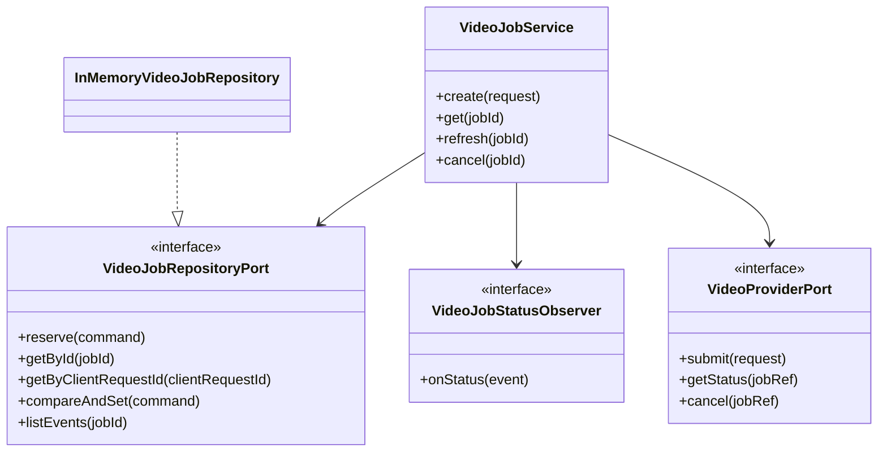
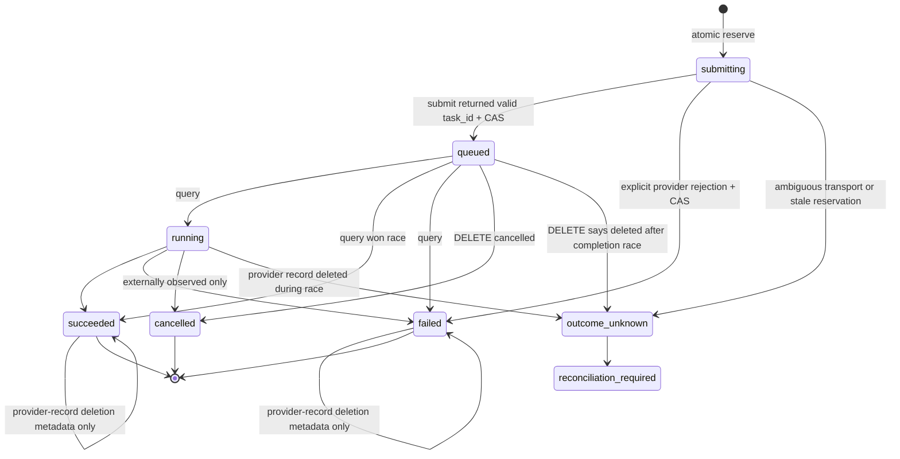

# ARS-006C — `video-job.v1` orchestration architecture

Status: approved offline orchestration slice; production persistence and hosted-provider activation remain deferred, 2026-08-24.

## Problem and constraints

ARS-006B defines `video-provider.v1` and verifies the MiniMax H3 `/v2` dialect with fake transport, but a provider adapter must not own product idempotency, durable state, or submit/cancel races. ARS-006C adds the Business orchestration contract without adding a production database, queue, HTTP route, UI, credential, media broker, global `fetch`, provider call, MP4 download, or billing action.

This slice guarantees state and duplicate suppression only within a single process using a test-only repository. It does not claim provider exactly-once execution or crash recovery. Production activation remains blocked on a real database migration, stale-reservation reconciliation owner, approved retention/deletion and cost policy, account ownership, processing-region review, and private media brokerage.

## Layer map and interfaces

| Layer | Component | Responsibility | Lifetime |
| --- | --- | --- | --- |
| Presentation | future private video controller/ViewModel | call the Business facade and render sanitized snapshots | request/view |
| Business | `VideoJobService` | create/get/refresh/cancel, idempotency, legal transitions, retry ownership, observer events | application |
| Business port | `VideoJobRepositoryPort` | atomic reservation, optimistic transition, snapshot/event reads | application |
| Business port | `VideoJobStatusObserver` | operational command evidence, isolated from Business outcomes | application |
| Business port | `VideoProviderPort` | one provider request per Business command | application |
| Data | `InMemoryVideoJobRepository` | deterministic repository contract adapter for tests only | test/application process |

Dependencies point inward: Presentation may depend on Business; Data implements Business ports; Business never imports Data. The production composition root does not assemble `VideoJobService` in this slice.



## Business record

`VideoJob` stores metadata only:

- `id`, `protocolVersion=video-job.v1`, `clientRequestId`, `requestDigest`.
- `requestSummary`: prompt SHA-256 and length, source asset ID/SHA-256/MIME/dimensions, output duration/resolution/ratio. Raw prompt, media bytes, media URL, provider body, authorization value, and API credential are forbidden.
- `status`: `submitting | queued | running | succeeded | failed | cancelled | outcome_unknown`.
- `outcomeCertainty`: `pending | known | unknown`.
- nullable canonical `{providerId, taskId}` only; `providerRecordDeletedAt`; allow-listed error code/message/retryable. Extra provider-reference fields, provider-supplied messages, and unknown codes are never persisted or exposed.
- optimistic `version`, `createdAt`, `updatedAt`.

`clientRequestId + requestDigest` is idempotent. Reusing the ID with a different digest returns `video_idempotency_conflict`. The digest is SHA-256 of the normalized `video-provider.v1` request. Raw input is never persisted.

## Logical persistence schema

No engine-specific migration is executed yet. A production adapter must implement these constraints before composition or HTTP wiring.

```sql
CREATE TABLE video_jobs (
  id                    VARCHAR(128) PRIMARY KEY,
  client_request_id     VARCHAR(128) NOT NULL UNIQUE,
  request_digest        CHAR(64) NOT NULL,
  prompt_digest         CHAR(64) NOT NULL,
  prompt_length         INTEGER NOT NULL CHECK (prompt_length BETWEEN 1 AND 2000),
  source_asset_id       VARCHAR(128) NOT NULL,
  source_sha256         CHAR(64) NOT NULL,
  source_mime_type      VARCHAR(32) NOT NULL,
  source_width          INTEGER NOT NULL,
  source_height         INTEGER NOT NULL,
  duration_seconds      INTEGER NOT NULL,
  resolution            VARCHAR(8) NOT NULL,
  ratio                 VARCHAR(16) NOT NULL,
  status                VARCHAR(32) NOT NULL,
  outcome_certainty     VARCHAR(16) NOT NULL,
  provider_id           VARCHAR(128),
  provider_task_id      VARCHAR(128),
  provider_deleted_at   TIMESTAMP NULL,
  error_code            VARCHAR(128) NULL,
  error_message         VARCHAR(256) NULL,
  error_retryable       BOOLEAN NULL,
  version               BIGINT NOT NULL CHECK (version >= 1),
  created_at            TIMESTAMP NOT NULL,
  updated_at            TIMESTAMP NOT NULL,
  CHECK ((provider_id IS NULL) = (provider_task_id IS NULL))
);
CREATE UNIQUE INDEX uq_video_jobs_provider_ref
  ON video_jobs(provider_id, provider_task_id)
  WHERE provider_id IS NOT NULL AND provider_task_id IS NOT NULL;

CREATE TABLE video_job_events (
  job_id          VARCHAR(128) NOT NULL REFERENCES video_jobs(id),
  sequence        BIGINT NOT NULL,
  event_type      VARCHAR(64) NOT NULL,
  previous_status VARCHAR(32),
  next_status     VARCHAR(32) NOT NULL,
  error_code      VARCHAR(128),
  terminal        BOOLEAN NOT NULL,
  occurred_at     TIMESTAMP NOT NULL,
  job_version     BIGINT NOT NULL,
  PRIMARY KEY (job_id, sequence)
);
CREATE UNIQUE INDEX uq_video_job_terminal_event
  ON video_job_events(job_id)
  WHERE terminal = TRUE;
```

`reserve` is one transaction: unique client-request check, job insert, sequence-1 event insert. `compareAndSet` is one transaction: `UPDATE ... WHERE id=? AND version=?`, provider-ref uniqueness check, and append-only event insert. No transaction or repository lock is held while calling the provider.

## State rules



Terminal states are `succeeded`, `failed`, and `cancelled`. They cannot change to another status. Only a succeeded/failed same-status metadata transition may set `providerRecordDeletedAt`; it must preserve certainty, provider ref, and error and cannot create a second terminal event. `outcome_unknown` is fail-closed and never automatically resubmitted or inferred as success/failure. A provider success response without a valid provider/task reference is treated as an ambiguous submit and becomes `outcome_unknown`.

## Create and race sequence

```mermaid
sequenceDiagram
  participant C as Caller
  participant S as VideoJobService
  participant R as VideoJobRepositoryPort
  participant P as VideoProviderPort
  participant O as VideoJobStatusObserver
  C->>S: create(video-provider.v1 request)
  S->>O: starting(operation/correlation IDs)
  S->>R: reserve(clientRequestId, requestDigest, safe summary)
  alt duplicate same digest
    R-->>S: existing snapshot
    S-->>C: replayed job; no provider call
  else duplicate conflicting digest
    R-->>S: video_idempotency_conflict
    S-->>C: 409; no provider call
  else created
    R-->>S: submitting v1
    S->>P: submit(request), no repository lock held
    P-->>S: task ref | explicit failure | outcome unknown
    S->>R: compareAndSet(expectedVersion=1, transition + event)
    alt stale CAS
      R-->>S: version conflict/current snapshot
      S-->>C: reconciliation-required conflict; never resubmit
    else committed
      R-->>S: sanitized snapshot
      S-->>C: job
    end
  end
  S->>O: exactly one terminal operation event
```

Concurrent same-ID requests converge at `reserve`; only the creator calls `submit`. A process crash after provider acceptance but before CAS can leave `submitting`; a future durable reconciler owns stale detection. The offline service allows `refresh` to mark an expired test reservation `outcome_unknown`, but cannot discover the provider task.

## Refresh, cancel, and retry ownership

- `get` reads the repository only and never calls a provider.
- `refresh` issues at most one `getStatus` call for `queued|running`; it does not loop. Retry/backoff belongs to a future bounded worker. A retryable query failure leaves the job unchanged.
- `cancel` issues at most one provider DELETE. It never retries automatically. `cancelled` becomes the terminal cancelled state.
- Provider failure codes/messages cross the Business boundary only through an allow-list; arbitrary provider text is replaced with a fixed generic failure.
- Provider action `deleted` is not cancellation. For an already succeeded/failed job it records `providerRecordDeletedAt` and preserves status. For a locally nonterminal job it indicates a cancel/complete race and becomes `outcome_unknown`.
- Terminal jobs reject status changes. `outcome_unknown` requires an explicit future reconciliation procedure.

## Durable events versus operational observer

`video_job_events` is append-only domain history committed with job state. `VideoJobStatusObserver` is separate operational evidence for each service method. Observer events contain timestamp, component, method, operation ID, correlation ID, state, safe error code/message, and never job/request/provider bodies. Each method emits `starting` followed by exactly one terminal `succeeded|failed|cancelled`; observer exceptions are contained and cannot change the Business result.

## DI, lifetime, rollback, and rejected alternatives

- Tests explicitly construct application-lifetime service/provider/repository/observer objects. Per-call operation context is transient.
- `InMemoryVideoJobRepository` requires injected clock and ID factory, returns immutable copies, and performs atomic synchronous Map mutations before resolving Promises. It is test-only and is not wired in `composition-root.mjs`.
- Rejected: calling the adapter directly from HTTP, because duplicate and ambiguous submissions would be unowned.
- Rejected: selecting SQLite/PostgreSQL now, because deployment, retention, pool, migration, and operations owners are not approved.
- Rejected: holding a database transaction across provider I/O, because it couples external latency to connection lifetime and cannot make the two systems atomic.
- Rollback removes ARS-006C modules/tests/doc only; ARS-006B remains disabled and runtime behavior is unchanged.

## Verification gate

- Repository contract: atomic duplicate reserve, immutable copy, optimistic conflict, provider-ref uniqueness, append-only ordering, one terminal event, legal transition enforcement.
- Service: concurrent duplicate create calls provider once; conflicting digest; success/failure/unknown finalize; stale reservation; CAS race; get without provider; one-query refresh; retryable read failure; cancel/complete race; terminal preservation.
- Observer: stable IDs, start-to-one-terminal sequence, redaction, and exception isolation.
- Full provider/API/image/ARS/build regressions after the latest edit; independent reviewer; drift and postflight.
