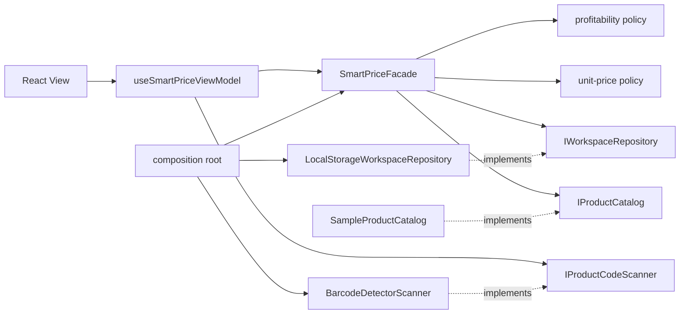
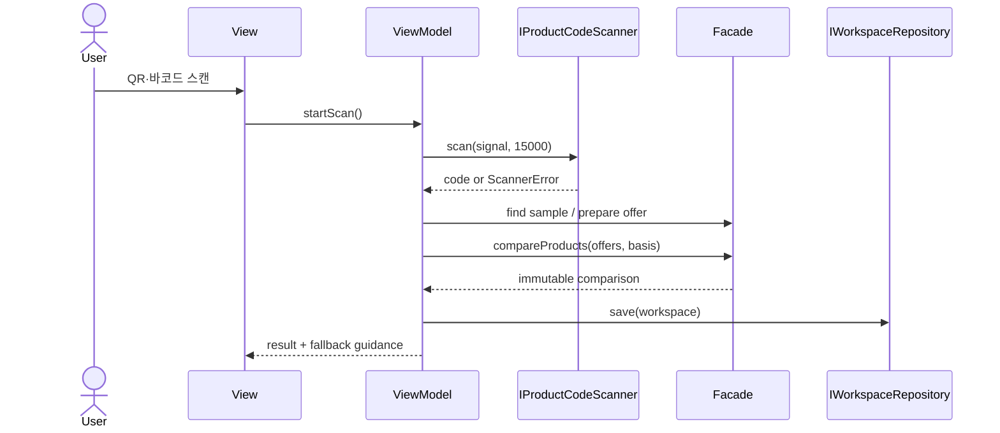

# Smart 가격비교 MVP 아키텍처

## 1. 가정과 제약

- 표시명은 `Smart 가격비교`, 패키지와 폴더 식별자는 `smart-price-comparison`이다.
- 소비자, 자영업자, 대행업체가 인증 없이 같은 브라우저에서 사용할 수 있는 한국어 반응형 SPA를 제공한다.
- 모든 가격은 원(KRW), 중량은 g, 용량은 ml 기준이며 금액 계산은 유한한 0 이상의 입력만 허용한다.
- 외부 마트 가격 API, 계정, 클라우드 동기화, POS·회계·세금 연동은 MVP에서 제외한다.
- 저장은 브라우저 `localStorage` 한 건의 버전 스냅샷으로 수행한다. 카메라는 HTTPS 또는 localhost와 사용자 권한이 필요하다.
- QR/EAN/UPC 스캔은 상품 코드를 취득한다. 로컬 카탈로그에 없는 상품은 사용자가 상품명과 가격을 입력한다.

## 2. 기능·품질 요구사항

- 메뉴 수익: 원재료 합계, 인건비, 가스비, 포장비, 수도세, 전기세를 합산해 총비용·이익·이익률·원가율을 계산한다.
- 상품 비교: 정상가 또는 명시적 할인가를 실구매가로 사용하고 절감액·할인율과 10g·100g·10ml당 가격을 계산한다.
- 같은 기준 단위의 상품끼리 최저가를 강조하며, 동률은 모두 최저가로 처리한다.
- 0원 메뉴가, 적자, 빈 목록, 잘못된 숫자, 저장 실패, 카메라 미지원·권한 거부·타임아웃을 안전하게 처리한다.
- 계산은 동기식 순수 함수로 즉시 수행한다. 카메라만 비동기이며 한 번에 하나의 세션만 소유한다.
- 키보드 사용, 명시적 레이블, 44px 이상 주요 터치 영역, 모바일/데스크톱 레이아웃을 지원한다.

## 3. 계층과 의존성



- Presentation: 화면 상태, 사용자 의도, 카메라 진행 표시와 오류 문구만 소유한다.
- Business: 도메인 모델, 검증, 수익·할인·단위가격 정책, 저장소·스캐너 인터페이스와 Facade를 소유한다.
- Data: 로컬 저장 DTO 매핑, 샘플 데이터, `BarcodeDetector`/카메라 어댑터를 소유한다.
- 허용 방향은 `Presentation -> Business interfaces <- Data implementations`이며 구체 어댑터 조립은 composition root에서만 한다.

## 4. 인터페이스 계약

### `IWorkspaceRepository`

- `load(): AppWorkspace | null`: 저장이 없으면 `null`, 손상되었거나 버전이 다르면 안전한 기본값으로 복구할 수 있도록 오류를 던진다.
- `save(workspace: AppWorkspace): void`: 전체 스냅샷을 한 번에 직렬화한다. 저장 공간 부족·브라우저 차단 오류를 호출자에게 전달한다.
- 애플리케이션 수명 동안 하나의 인스턴스를 사용하며 UI 프레임워크 타입을 노출하지 않는다.
- 테스트에서는 메모리 구현으로 교체한다.

### `IProductCodeScanner`

- `isSupported(): boolean`: 카메라, 보안 컨텍스트, `BarcodeDetector` 지원 여부를 함께 판별한다.
- `scan(signal: AbortSignal, timeoutMs: number): Promise<string>`: 최초로 인식한 QR/EAN/UPC 원문을 반환한다.
- 동시 호출은 허용하지 않는다. 취소·타임아웃·권한 거부는 구분 가능한 `ScannerError` 코드로 변환한다.
- 성공·실패·취소 모두에서 video element를 제거하고 모든 `MediaStreamTrack`을 중지한다. 자동 재시도는 하지 않는다.

### `IProductCatalog`

- `findByCode(code): ProductOffer | null`: 상품 코드 조회만 담당하며 Presentation에 샘플 데이터나 Data 타입을 노출하지 않는다.
- MVP는 로컬 샘플 구현을 사용하고, 향후 외부 가격 수집기는 같은 Business 포트를 구현한다.

### `SmartPriceFacade`

- 순수 계산 함수와 저장소 포트를 묶는 애플리케이션 진입점이다.
- `calculateMenu`, `compareProducts`, `findProductByCode`, `createDefaultWorkspace`, `loadWorkspace`, `saveWorkspace`를 제공한다.
- 비유한 숫자와 음수는 저장·계산 전에 0으로 정규화하며 도메인 결과는 불변 값으로 반환한다.

## 5. 로컬 저장 스키마

키: `smart-price-comparison:workspace:v1`

```ts
interface AppWorkspaceDtoV1 {
  schemaVersion: 1;
  persona: "consumer" | "owner" | "agency";
  activeView: "dashboard" | "menu" | "products";
  menuDraft: MenuDraftDto;
  products: ProductOfferDto[];
  updatedAt: string;
}
```

- `ProductOfferDto.id`와 `MenuIngredientDto.id`는 스냅샷 안에서 유일하다.
- 목록은 사용자가 정한 순서를 보존한다. 현재 데이터량은 수십 건으로 제한해 인덱스·페이지네이션이 필요 없다.
- `schemaVersion` 불일치는 기본 샘플로 되돌리고 사용자에게 복구 알림을 제공한다.
- 단일 `localStorage.setItem`이 스냅샷 커밋 경계다. 별도 트랜잭션이나 롤백은 없으며 실패 시 기존 값은 유지된다.
- 향후 v2는 새 키에 기록한 뒤 성공 시 활성 키를 전환하는 방식으로 마이그레이션한다.

## 6. 주요 흐름



## 7. 수명·DI·스레딩

- composition root가 저장소, 스캐너, Facade를 한 번 생성하고 React 루트에 주입한다.
- 저장소와 Facade는 애플리케이션 수명, 스캔 세션과 `AbortController`는 요청 수명이다.
- 종료 순서는 스캔 취소 → 미디어 트랙 중지 → React 해제 순서다. 취소는 여러 번 호출해도 안전하다.
- 계산과 localStorage 접근은 짧고 동기적으로 UI 스레드에서 수행한다. 카메라 프레임 인식만 브라우저 비동기 API를 사용하며 결과 상태 변경은 Promise 완료 후 UI 스레드에서 수행한다.
- 공유 가변 전역 상태와 서비스 로케이터를 사용하지 않는다.

## 8. 선택과 제외한 대안

- React + Vite + TypeScript: 기존 저장소의 웹 도구와 맞고 정적 배포가 간단하다. 서버 렌더링은 인증·SEO가 핵심이 아닌 MVP에 과하다.
- `localStorage`: 서버 없이 즉시 가치를 검증할 수 있다. 다중 기기·대행업체 협업에는 부족하므로 향후 서버 저장소가 같은 포트를 구현한다.
- 네이티브 `BarcodeDetector`: 의존성과 번들 크기가 작다. 브라우저 지원 범위가 제한되므로 수동 코드 입력을 필수 동등 경로로 둔다.
- 월 공과금 배분 입력은 이번 계산식에서 제외하고 메뉴 1개 판매분에 귀속되는 비용을 직접 입력한다. 판매량 기반 배분은 다음 슬라이스 후보로 둔다.

## 9. 구현 슬라이스와 검증 게이트

1. 도메인 모델·계산 정책: 계산식, 0원/적자, 할인, g/ml 정규화, 동률 최저가 단위 테스트.
2. 저장·스캔 어댑터: 스키마 검증, 저장 복원, 스캐너 지원 판별·취소·수동 fallback 테스트.
3. composition root·ViewModel·화면: 세 페르소나 진입, 메뉴/상품 전체 흐름, 반응형·접근성 확인.
4. 생산 빌드와 브라우저 스모크: 샘플 데이터 렌더링, 계산 상호작용, 수동 코드 fallback을 검증한다.
